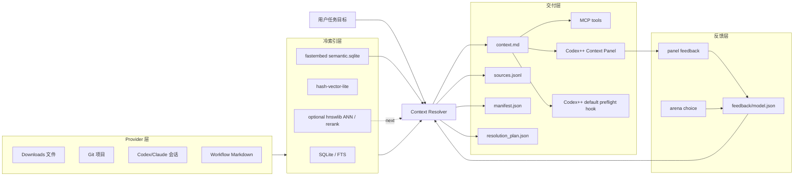

# Agent Context Runtime v1.0 Goal

## 目标

把本机资料变成 agent 可查、可读、可反馈、可后台更新的本地上下文运行时。用户只给一个任务目标，系统自动决定该查 Downloads、Git 项目、Codex/Claude 会话还是工作流文档，并生成当前 Codex/Codex++ 可直接读取的热上下文包。

## 总体判断

v0.3、v0.4、v0.5 不再拆成三个验收版本，合并成 v1.0。原因是这些能力是乘法关系：resolver 没有好索引会选不准，语义索引没有默认接入不会被使用，feedback 不改变排序就不会长期变聪明，Codex++ 不默认触发就仍然是手动工具。

## 系统图



## v1.0 验收标准

1. 用户输入任务目标后，Codex++ 面板可以直接生成 context pack。
2. Resolver 默认能查 Downloads、Git 项目、会话、workflow provider，且输出可解释的 resolution plan。
3. 冷索引同时有关键词召回和语义召回；语义索引后台刷新，不阻塞前台任务。
4. MCP 暴露 search/read/resolve/panel/feedback/semantic refresh，其他 agent 可以直接调用。
5. 用户反馈能影响后续排序，并能用 arena replay 评估是否变好。
6. 所有文件读取只读，权限边界清楚；压缩包默认 metadata-only。
7. 每次生成的热包包含路径、摘要、少量引用、限制、下一步。

## Subagent 编排

主 agent 保持架构一致性和最后集成，subagents 只做并行、可独立验收的侧路任务：

| Subagent | 责任 | 交付 |
| --- | --- | --- |
| Index Agent | semantic.sqlite、ANN、增量索引策略 | 索引实现、benchmark、失败样本 |
| Resolver Agent | source registry、query planner、fusion/rerank | resolver 规则和测试 |
| Integration Agent | MCP、Codex++ Panel、默认 hook | UI/命令接入、smoke 记录 |
| Eval Agent | arena replay、反馈模型、回归集 | eval report、bad cases |
| Safety Agent | 权限、忽略规则、隐私策略 | policy 文档、危险路径测试 |

## 当前状态

| 模块 | 当前成熟度 | 说明 |
| --- | ---: | --- |
| Downloads 扫描/抽取 | 70% | 已能跑真实 Downloads；OCR、音视频、复杂 Office 仍未完成 |
| Provider Layer | 86% | 统一生成项目、Codex/Claude 会话、workflow Markdown provider cards；真实刷新写入 111 个项目、300 个会话 card、13 个 workflow card；session card 已可按需渲染清洗后的 transcript preview，并可写入 session transcript index；仍缺全局 workflow 发现和完整会话正文回放 |
| Git Project Discovery | 72% | 已能发现并索引项目，并接入 provider manifest；缺项目重要性模型 |
| Cold Index / RAG | 88% | SQLite/FTS/hash-vector-lite 可用；resolver 已能融合 semantic.sqlite exact scan，并可选 `AGENT_CONTEXT_ANN_BACKEND=hnswlib` 走 HNSW ANN；HNSW 图会按 semantic rows fingerprint 缓存在 `indexes/semantic_ann/`；新增正式 `semantic-benchmark` 和 `retrieval-eval` CLI/MCP，可在不重写主索引的前提下比较 hash、FastEmbed rerank 和 semantic-fusion，并用人工 expected source 计算 Top1/Recall/MRR；retrieval eval 胜负会编译到 `feedback/route_selector_model.json` 并影响 resolver 排序 |
| Semantic Background Index | 99% | fastembed 已写入本机 semantic.sqlite；resolver 实测读取 project/session semantic 候选；`semantic-refresh/semantic-maintain` 支持 downloads/projects/sessions/all；新增 hnswlib ANN cache、fallback 到 exact scan、`semantic-ann-prune` 缓存清理、`semantic-launchd` LaunchAgent 生成/安装入口，以及 CLI/MCP/panel 只读状态检查；本机 LaunchAgent 已安装并 bootstrap 到 `gui/501`，维护脚本手动实跑处理 64 个 semantic chunks，launchd `kickstart` 已跑通并记录 `runs=2`、`last_exit_code=0`；`semantic-launchd-wait` 已捕获一次真实自然周期，`runs` 从 2 增至 3，并生成 06:39/06:40 的 maintain/prune/monitor 报告；新增 `semantic-launchd-audit` 可把 monitor 历史判断为 `ok/warning/alert` 并给出失败 code，且支持显式 `--notify` macOS 通知；新增 `semantic-launchd-recover` dry-run/apply 恢复计划，可安装、bootstrap、kickstart 或采样 monitor，并支持 `--verify-after-apply` 二次验证；新增 `semantic-launchd-trend` 按 day/hour 聚合 monitor 历史并区分 `short_window` 与 multi-day confidence；Codex++ Manager Semantic maintenance 卡已完成 headless UI 截图验收；真实 project benchmark 已覆盖 5755 documents / 24485 chunks；仍缺多天稳定性 benchmark |
| Hot Context Pack | 84% | context.md/sources/manifest/resolution_plan 可生成，并能引用 provider card、项目代码 chunk 和 semantic 候选 |
| Context Resolver | 95% | 支持 downloads/gitProjects/codexSessions/agentSessions/workflowDocs/all source_scope，项目代码证据、session transcript chunks、semantic exact/ANN cache 和 provider cards 已融合；retrieval-eval route selector prior 已持久化为模型文件并进入 resolver；arena pairwise 的 Elo 与 Bradley-Terry prior 已进入 `resolver_score_parts`；排序仍缺更大真实样本长期验证 |
| MCP | 95% | 已有 resolve/panel/feedback/feedback replay/feedback replay cases/retrieval eval/retrieval eval cases/route selector model/semantic refresh/semantic maintain/semantic benchmark/semantic ann prune/semantic launchd status/semantic launchd monitor/refresh_providers/index_sessions/access_audit/access_policy/grant_access_consent tools，并能读 project/workflow provider card、session transcript preview、session index chunk、后台语义维护健康状态、结构化 launchctl 状态和历史快照；还不是所有 agent 默认入口 |
| Safety / Permissions | 96% | `read_source` 已限制为索引/provider 命中源或 `--out` 下生成产物，外部裸路径读取会拒绝；新增 `config/access_policy.json`，resolver 和 MCP read 均按 provider/path allow/deny 过滤；CLI/MCP/Codex++ Manager 可增删 provider/path allow/deny/require-consent 规则；read_source 支持 require-consent provider/path 与 per-source grant；Codex++ Manager 可从 access audit 的 consent_required 事件直接 grant；新增 `reports/access_audit.jsonl` 记录读取/过滤/consent 元数据，并支持 gzip 轮转；仍缺按时间/任务过期的 consent 和更细粒度 consent UX |
| Codex++ Integration | 99% | 面板可手动生成热包、任务预检、打开生成文件、展示 access audit、编辑 access policy allow/deny/require-consent 规则，并可对 consent_required 事件一键 grant；`panel/status.json` 已包含 `feedback.replay_trend`，HTML panel 展示 replay health/top1/regression；Codex++ 启动时可后台 prewarm；task preflight core command、Manager 入口、bridge/helper route 和 `thread/start` / `turn/start` 注入底座已打通；真实隔离 GUI 运行态已验证 dispatcher hook 安装到 `vscode-api.f`，并捕获到 `turn/start` 消息被追加 `codex_preflight.md` / `context.md` / `sources.jsonl`；Manager 已映射 `semantic_launchd` 并展示后台语义维护健康状态；新增 `smoke-agent-context-panel-status.mjs` 固化 panel/status 契约验收，`smoke-agent-context-runtime.mjs` 固化真实运行态验收；已补 headless UI 截图验收；仍缺用户手动点击 UI 发消息截图和长期稳定性监控 |
| Feedback / Arena | 99% | arena 选择已写成 winner/loser pairwise 事件，并按 query family 进入 feedback/model.json 影响 resolver；已有 replay eval、generated replay cases、“不对”替代路线、Elo 弱统计信号、Bradley-Terry 批量 pairwise 学习、带人工 expected source 的 retrieval eval、eval 驱动且可持久化的 route selector prior；`feedback/model.json` 0.7 会把 replay case 的 expected source 编译为受限 query-family rerank prior；新增 `feedback-replay-trend` CLI/MCP 读取历史 replay 报告并判断 expected source 丢失、rank regression 和历史不足；arena feedback 会自动生成 raw retrieval eval cases，`retrieval-eval-cases` CLI/MCP 可把 raw feedback 去重、过滤坏样本并生成 curated eval cases；仍缺更大真实样本集和 UI 闭环 |

## v1 验收总账

`agent-context v1-acceptance` 是当前宏大目标的交接入口。它不重新定义能力，只读取最新的：

1. `reports/runtime-health-latest.*`
2. `reports/semantic-readiness-latest.*`
3. `reports/mcp-live-smoke-latest.*`
4. `reports/reproducibility-snapshot-latest.*`

然后生成：

- `reports/v1-acceptance-latest.json`
- `reports/v1-acceptance-latest.md`

状态含义：

| 状态 | 含义 |
| --- | --- |
| `ok` | v1 验收证据完整 |
| `waiting_for_time` | 实现证据已在，唯一剩余项是 semantic launchd 跨日趋势证据 |
| `warning` | 有非阻塞警告，需要人工看证据 |
| `failed` | 缺失、过期或失败证据阻塞验收 |

推荐交接命令：

```bash
agent-context v1-acceptance \
  --out /Users/gengrf/agent-context-system \
  --codex-plus-root /Users/gengrf/Code/research/CodexPlusPlus-BigPizzaV3 \
  --refresh-evidence
```

## 下一阶段执行目标

### Goal A: Codex++ 默认上下文入口

把 Codex++ Context Panel 从状态面板变成控制面板，并提供默认 hook 的 dry-run/prewarm 开关。

验收：
- 面板输入 goal 后生成 context pack。
- 可打开 context.md、sources.jsonl、manifest.json、resolution_plan.json。
- 失败时保留错误状态，不中断 Codex++ 主功能。
- 默认 hook 先做 dry-run/prewarm，不污染普通 passive suggestions。

### Goal B: 语义索引进入 resolver

让后台 semantic.sqlite 成为 resolver 的一个候选源，而不是只写不用。

验收：
- resolver 融合 FTS、hash-vector-lite、semantic.sqlite 三路候选。已完成 exact scan 融合。
- fast 模式使用小预算语义召回；deep 模式扩大预算。
- ANN 不可用时使用 SQLite exact scan fallback。已完成；hnswlib 可选 ANN 已接入。
- benchmark 输出对比：hash-only vs semantic-fusion。

### Goal C: Feedback 变成排序信号

把 panel feedback 和 arena 选择从日志变成 rerank prior。

验收：
- feedback/model.json 记录 source、query family、winner/loser、rating。winner/loser pairwise 与 query family scoped prior 已完成。
- resolver 对同类 goal 使用反馈 prior。source/project/group/query-family prior 已完成。
- replay 一组固定任务，输出选择前后差异。已完成 deterministic replay report。
- 用户选择“不对”时，系统生成替代路线，而不是重复同一答案。已完成 `resolve-alternative`。

### Goal D: Provider 层补齐

Downloads、Git 项目、会话、workflow 文档统一成 ProjectScope provider。

验收：
- provider manifest 描述 source family、权限、更新时间、索引状态。已完成项目、session、workflow 三类 manifest。
- resolver 可解释为什么查这个 provider。已完成 source_scope 和 `resolution_plan.json` 解释。
- Git 项目不是全盘变 Markdown KV，而是项目卡片 + README/docs/source chunk + symbol 摘要。已完成。
- 会话 provider 先从 Codex/Claude session metadata 和少量摘要开始，不全量塞进热包。已完成 provider card、按需 transcript preview 和 `indexes/sessions.sqlite` 会话片段索引；完整 transcript replay 未做。

## 当前执行记录

2026-06-15 本轮推进 Codex++ Context Panel：
- Rust core 新增 `run_agent_context_panel`，调用 `agent-context panel`。
- Tauri 新增 `run_agent_context_panel` command。
- React 面板新增任务目标输入和“生成上下文包”按钮。
- 面板列出 `resolution_plan.json`。
- 已 smoke：`agent-context panel --goal "告诉我本地所有项目里如何构建个人推荐系统"` 生成 8 条来源的 context pack。

2026-06-15 续跑推进 Codex++ 默认入口：
- Rust core 新增 `start_launch_prewarm`，Codex++ 启动时读取面板最后一次 goal 并后台预热 Agent Context。
- `launch_codex_plus` / `restart_codex_plus` 成功受理后触发 prewarm；失败或 skipped 只写 Agent Context 状态，不阻断 Codex++ 主启动。
- React 启动/重启后刷新 Context Panel 状态，并展示 last goal。
- 已验证：`cargo test -p codex-plus-core agent_context --lib` 通过；`cargo check -p codex-plus-manager` 通过。
- 未验证：没有实际调用 `launch_codex_plus`，因为这会真的启动 Codex++。

2026-06-16 推进 Codex++ task preflight 默认调用底座：
- Codex++ core 新增 `run_agent_context_task_preflight(goal)`，调用 `agent-context codex-preflight`，返回 `codex_preflight.md`、`context.md`、`sources.jsonl`、`manifest.json`、`resolution_plan.json`。
- Tauri 新增 `run_agent_context_task_preflight` command，Manager 面板新增“任务预检”按钮和 `codex_preflight.md` 文件行。
- `AgentContextPanelStatus` 新增 `lastCodexPreflightMd`，任务预检会写回状态，供后续 turn/start 自动 hook 读取。
- 已验证：`cargo test -p codex-plus-core agent_context --lib` 5 passed；`cargo check -p codex-plus-manager` 通过；`npm --prefix apps/codex-plus-manager run check` 通过；底层 `agent-context codex-preflight` 生成 `packs/context-pack-resolve-20260616013311317230/codex_preflight.md`。
- 仍未完成：还没有把真实 Codex++ 客户端打开并发一次任务做截图/日志验证。

2026-06-16 续跑 Codex++ 默认注入入口：
- Codex++ bridge 新增 `/agent-context/task-preflight` route，HTTP helper 同步支持同一路径，注入层在 bridge 不可用时可回退到 helper。
- Renderer dispatcher patch 已识别 `thread/start` / `turn/start` 相关消息形态，自动从任务文本抽取 goal，调用 task preflight，并把 `codex_preflight.md` / `context.md` / `sources.jsonl` 路径提示追加到当前任务文本。
- 注入层只让目标请求等待 preflight；非目标 dispatch 保持同步直通。preflight 失败时回退到原始消息，不阻断 Codex++ 主功能。
- 已验证：`node --check assets/inject/renderer-inject.js` 通过；`cargo test -p codex-plus-core agent_context --lib` 通过；`cargo test -p codex-plus-core --test bridge_routes -- --nocapture` 通过；`cargo check -p codex-plus-manager` 通过；`npm --prefix apps/codex-plus-manager run check` 通过。
- 仍未完成：缺真实 Codex++ 运行态 smoke，包括发送任务、确认 prompt 中出现 `[Codex++ Auto Context]`、确认 pack 文件路径可打开。

2026-06-16 续跑 Codex++ 注入层自动化 smoke：
- `cdp_bridge` 新增 Agent Context 默认 preflight hook 覆盖：检查注入脚本包含 `/agent-context/task-preflight`、`[Codex++ Auto Context]`、goal 抽取、hint 追加和 `thread/start` / `turn/start` 入口。
- 新增 Node harness，模拟 Codex bridge 返回 `codex_preflight.md`、`context.md`、`sources.jsonl`，验证 `send-cli-request-for-host` + `turn/start` 的任务文本会被追加本地上下文提示。
- 修复 `bridgeWithBackendTimeout` 的 timeout timer 泄漏：bridge 成功返回后立即清理 30 秒 preflight timeout，避免每次成功调用都留下长 timer。
- 已验证：`node --check assets/inject/renderer-inject.js` 通过；`cargo test -p codex-plus-core agent_context --test cdp_bridge -- --nocapture` 2 passed；`cargo test -p codex-plus-core --test cdp_bridge -- --nocapture` 55 passed；`cargo test -p codex-plus-core --test bridge_routes -- --nocapture` 23 passed。
- 本机状态：`/Applications/Codex++.app` 和 `/Applications/Codex++ 管理工具.app` 存在，但 57321 helper 未运行；为避免影响当前正在运行的 Codex 会话，本轮没有真实发消息 smoke。

2026-06-16 续跑 Codex++ helper runtime smoke：
- `paths.rs` 新增 Agent Context panel config/status/feedback 的 test-only path override，避免测试污染真实 `~/.codex-session-delete` 配置。
- `launcher` 测试新增真实 HTTP helper smoke：启动 helper 到随机端口，POST `/agent-context/task-preflight`，用临时 fake `agent-context` CLI 返回 preflight JSON，并断言 helper 返回 `codexPreflightMd`、`contextMd`、`sourcesJsonl` 且状态写入临时 status 文件。
- 这证明默认注入层的 HTTP fallback route 能在运行时 helper 里走通到 task preflight contract，不需要启动真实 Codex GUI。
- 已验证：`cargo test -p codex-plus-core --test launcher -- --nocapture` 42 passed；`cargo test -p codex-plus-core --test cdp_bridge -- --nocapture` 55 passed；`cargo test -p codex-plus-core --test bridge_routes -- --nocapture` 23 passed；`cargo test -p codex-plus-core agent_context --lib` 5 passed；`cargo check -p codex-plus-manager` 通过；`cargo fmt --check` 通过。
- 仍未完成：缺从当前工作树启动 Codex++ 并真实发送一条任务的 GUI smoke。现有 macOS launcher 使用 `open -W -a Codex.app --args ...`，缺独立 profile / `open -n` 隔离能力，直接跑会复用或影响当前 Codex 主窗口。

2026-06-16 续跑 Codex++ isolated GUI smoke 前置能力：
- `LaunchOptions` 新增 `macos_new_instance` 和 `user_data_dir`，macOS app 启动命令可显式生成 `open -n -W -a Codex.app --args --user-data-dir=<dir>`，用于隔离真实 GUI smoke。
- `codex-plus-launcher` 新增 `--macos-new-instance` 和 `--user-data-dir <dir>` 参数，已有实例激活路径和普通启动路径都会把隔离 profile 参数传到 Codex。
- launcher runtime 补齐 `/agent-context/task-preflight` bridge method，避免 launcher 自身测试/运行时缺 trait 实现。
- 已验证：`cargo test -p codex-plus-core --test launcher -- --nocapture` 44 passed；`cargo test -p codex-plus-launcher -- --nocapture` 6 passed；`cargo test -p codex-plus-core --test cdp_bridge -- --nocapture` 55 passed；`cargo test -p codex-plus-core --test bridge_routes -- --nocapture` 23 passed；`cargo check -p codex-plus-launcher`、`cargo check -p codex-plus-manager`、`cargo test -p codex-plus-core agent_context --lib` 均通过。
- 仍未完成：还没有真正用 isolated profile 启动 Codex++、发一条任务、截图/日志确认 `[Codex++ Auto Context]` 进入真实 prompt。

2026-06-16 完成 Codex++ 真实运行态 auto-context smoke：
- 真实隔离启动 Codex++：临时 HOME 为 `/tmp/codex-plus-agent-context-smoke-home`，隔离 profile 为 `/tmp/codex-plus-agent-context-smoke-profile`，remote debug 端口 9333，helper 端口 57322。
- 发现当前 Codex 26.609.41114 不再从 `setting-storage` 导出 dispatcher；真实 dispatcher 在 `vscode-api-*.js` 的 `f` 单例对象上。
- 注入层新增 `loadCodexAppMessageDispatcher()`：优先使用 `vscode-api.f`，再回退 `vscode-api.d.getInstance()` 和旧版 `setting-storage.v.getInstance()`。
- 真实日志确认：`renderer.service_tier_dispatcher_patch_installed`，source 为 `vscode-api.f`。
- 真实 dispatcher smoke 发送假 `turn/start` 消息，捕获到发往主进程的 payload 中，任务文本后已追加 `[Codex++ Auto Context]`、`Preflight:`、`Context:`、`Sources:`。
- 本次生成 pack：`/Users/gengrf/agent-context-system/packs/context-pack-resolve-20260616021625696258/codex_preflight.md`，包含 8 条 sources。
- 已验证：`node --check assets/inject/renderer-inject.js` 通过；`cargo test -p codex-plus-core agent_context --test cdp_bridge -- --nocapture` 通过；`cargo build -p codex-plus-launcher` 通过；真实 helper `/agent-context/task-preflight` 与真实 renderer hook 均已走通。
- 当时未完成：还没有用户手动从 Codex UI 输入任务并截图验证；还没有把此 smoke 固化成可重复的一键命令。

2026-06-16 固化 Codex++ Agent Context runtime smoke：
- Codex++ 仓库新增 `scripts/smoke-agent-context-runtime.mjs`，一条命令完成构建 launcher、写临时 Agent Context 配置、隔离启动 Codex.app、等待 dispatcher hook、通过 CDP 捕获真实 `turn/start` payload、验证 `[Codex++ Auto Context]` 和 context pack 路径。
- README 开发区新增 smoke 命令：`AGENT_CONTEXT_ROOT=/Users/gengrf/agent-context-system scripts/smoke-agent-context-runtime.mjs`。
- 实测命令：`AGENT_CONTEXT_ROOT=/Users/gengrf/agent-context-system CODEX_PLUS_SMOKE_GOAL='开源往事如何在番茄爆火，面向的读者是谁' scripts/smoke-agent-context-runtime.mjs`。
- 实测结果：`status=ok`，`hookVersion=3`，`hasHint/hasPreflight/hasContext/hasSources=true`。
- 本次自动生成 pack：`/Users/gengrf/agent-context-system/packs/context-pack-resolve-20260616022443565012/codex_preflight.md`。
- 仍未完成：该 smoke 还未纳入 CI；真实用户点击发送任务的截图验收仍需人工窗口操作。

2026-06-16 推进 semantic.sqlite 进入 resolver：
- `semantic_index.py` 新增 `search_semantic_index`，可按 source kind 对 `semantic_chunks` 做 exact vector scan。
- resolver 按 selected sources 把 semantic source kind 映射为 Downloads / Git 项目候选，并与 FTS/hash-vector-lite/project code 候选融合。
- resolver 默认要求 semantic source 至少 16 行，避免刚初始化的小 semantic index 把无关文件推到前排；跳过原因会写进 `resolution_plan.json`。
- 同一个 chunk 多路命中时保留 `score_parts` 和 `retrieval_channels`，解释里能看到 semantic 是否参与。
- 已验证：新增 semantic resolver 测试通过；`uv run pytest -q` 全量 46 passed。
- 早期 smoke：真实本地 resolve 记录 `semantic index has 2 row(s), below minimum 16`，并回退到 project code index 结果。
- 当时未完成：ANN、真实 rerank 学习、系统级后台安装和 semantic benchmark 报告。

2026-06-16 续跑语义索引扩容和排序防护：
- `semantic-refresh --source projects --budget 128 --backend fastembed` 成功把本机 semantic.sqlite 扩到 130 行。
- 真实 resolver 查询 `告诉我本地所有项目里如何构建个人推荐系统` 时，候选统计为 `git_project=111`、`project_code_index=128`、`semantic_index=128`。
- 修复 semantic-only 噪声：语义候选如果没有足够词面支撑，会保留为候选但降权，且不能因为多个 query 改写重复命中而获得 query coverage 满分。
- semantic refresh 选样加入 project/path bucket cap，避免后台刷新早期被单一项目填满。
- benchmark 已支持 `semantic-fusion` 对照，报告：`reports/embedding_backend_benchmark_projects_20260616003535000083.md`。
- 已验证：语义防护单元测试、semantic resolver 测试、benchmark 脚本测试通过；真实 resolve 生成 `packs/context-pack-resolve-20260616003352277040/context.md`。
- 当时未完成：ANN、默认 Codex 任务前置 resolver、全盘 provider 调度器、feedback 统计学习。

2026-06-16 续跑后台语义索引维护入口：
- 新增 `semantic-maintain`，把一次或多次 `semantic-refresh` 包成 scheduler-safe 维护 pass。
- 支持 `--max-jobs` 和 `--min-interval-minutes`，可以被 launchd/cron 反复调用，最近刚跑过时会自动跳过。
- 每次维护写 `reports/semantic-maintain-*.json` 和 `.md`，记录 processed、stop_reason、before/after chunks 和 job 列表。
- MCP 新增 `semantic_maintain`，其他 agent 可以通过 MCP 触发同一维护入口。
- 已验证：`uv run pytest -q` 全量 54 passed；真实小预算维护把 `semantic.sqlite` 从 258 扩到 266 行，并验证 `--min-interval-minutes 30` 会跳过。
- 真实报告：`reports/semantic-maintain-20260616012425674761.md`、`reports/semantic-maintain-20260616012434887847.md`。

2026-06-16 推进 Optional ANN Semantic Retrieval：
- `retrieval_backends.py` 新增 `AGENT_CONTEXT_ANN_BACKEND` 配置读取和 `hnswlib` HNSW dense-row scoring；默认仍是 `exact-json-scan`。
- `semantic_index.py` 的 `search_semantic_index` 会在 `AGENT_CONTEXT_ANN_BACKEND=hnswlib` 且 embeddings 为 dense float vectors 时使用 `semantic_hnswlib_ann`，否则自动 fallback 到 `semantic_exact_vector_scan`。
- `resolution_plan.json` 新增 `semantic_retrieval_modes` 和 `semantic_ann_fallbacks`，热包 limitation 会披露本次 semantic 候选实际来自 ANN 还是 exact fallback。
- README / MCP 文档新增 hnswlib ANN 开启方式和 fallback 说明。
- 已验证：fake hnswlib 单元测试和 resolver semantic ANN 测试通过；`uv run pytest tests/test_retrieval_backends.py tests/test_context_resolver.py::test_resolver_uses_background_semantic_index_for_git_projects -q` 8 passed；相关 Python 文件 py_compile 通过。
- 当时仍未完成：持久化 ANN index 文件、真实 hnswlib 大规模 benchmark、系统级 rerank 学习。

2026-06-16 推进 Persistent HNSW ANN Cache：
- `score_dense_rows_with_hnswlib_cached` 支持把 HNSW graph 保存到磁盘，并用 metadata 记录 fingerprint、dimensions 和 source_ids。
- `semantic_index.py` 根据 semantic rows、source kinds、embedding backend 和 embedding_json 生成 fingerprint，缓存文件写到 `indexes/semantic_ann/hnswlib_<fingerprint>.bin/json`。
- resolver 的 `resolution_plan.json` 新增 `semantic_ann_cache_statuses`，能区分 `rebuilt`、`loaded`、`memory`、`fallback`；`context.md` limitation 会披露 ANN cache 状态。
- 缓存不改变默认行为：未设置 `AGENT_CONTEXT_ANN_BACKEND=hnswlib` 仍走 exact scan；hnswlib 不可用或 rows 不兼容仍 fallback。
- 已验证：fake hnswlib 缓存测试和 resolver semantic ANN cache 测试通过；`uv run pytest tests/test_retrieval_backends.py tests/test_context_resolver.py::test_resolver_uses_background_semantic_index_for_git_projects -q` 9 passed；相关 Python 文件 py_compile 通过。
- 当时仍未完成：真实 hnswlib 大规模 benchmark、缓存清理/压缩策略、系统级 rerank 学习。

2026-06-16 推进 Semantic ANN Cache Prune：
- 新增 `run_semantic_ann_prune`，会按当前 `semantic.sqlite` rows 计算 active fingerprints，删除不再匹配的 stale HNSW cache。
- 支持 `max_entries`、`max_bytes` 和 `dry_run`，可先报告将删除哪些文件，再实际清理。
- 清理报告写入 `reports/semantic-ann-prune-*.json` 和 `.md`，记录 removed files、reason、bytes、active fingerprints。
- CLI 新增 `agent-context semantic-ann-prune --max-entries --max-bytes --dry-run`；MCP 新增 `semantic_ann_prune(...)`。
- 已验证：semantic maintenance 测试覆盖 dry-run 不删除、stale cache 删除、active cache 保留、CLI 和 MCP 调用；`uv run pytest tests/test_semantic_maintenance.py -q` 5 passed。
- 仍未完成：真实 hnswlib 大规模 benchmark、缓存压缩/分层策略、系统级 rerank 学习。

2026-06-16 推进 Semantic LaunchAgent 安装入口：
- 新增 `launchd.py`，可生成 macOS LaunchAgent plist 和 `out/scripts/<label>.sh` 维护脚本。
- CLI 新增 `agent-context semantic-launchd --print/--install/--uninstall`；`--print` 只输出 plist/script，不写文件；`--install` 写 LaunchAgent plist、脚本和日志目录；`--uninstall` 删除 plist 和脚本。
- 生成脚本会顺序运行 `semantic-maintain` 和 `semantic-ann-prune`，把后台 refresh 与 ANN cache 清理合成一个定时维护 pass。
- 默认不自动执行 `launchctl bootstrap`，避免测试或误操作时启动后台任务；用户可确认后手动 bootstrap。
- 已验证：launchd 单元测试覆盖 print 不写、install 写 plist/script、uninstall 删除、CLI print；真实 `semantic-launchd --print` 在 `/Users/gengrf/agent-context-system` 成功渲染配置且未写入 LaunchAgents。
- 2026-06-16 已在本机真实安装：`/Users/gengrf/Library/LaunchAgents/com.gengrf.agent-context.semantic-maintenance.plist` 和 `/Users/gengrf/agent-context-system/scripts/com.gengrf.agent-context.semantic-maintenance.sh`；plist PATH 固定为 `/opt/homebrew/bin:/usr/local/bin:/usr/bin:/bin:/usr/sbin:/sbin`，避免写入 Codex 临时 PATH。
- 仍未完成：真实定时周期后的自动运行观测、多小时/多天运行监控、失败重试告警、大规模增量策略。

2026-06-16 推进 Semantic LaunchAgent Status Monitor：
- 新增 `semantic_launchd_status`，只读检查 LaunchAgent plist、维护脚本、stdout/stderr 日志、最近 `semantic-maintain` 和 `semantic-ann-prune` 报告。
- CLI 新增 `agent-context semantic-launchd-status --out ...`，返回 `installed`、`health`、`issues`、`reports`、`logs` 等 JSON 字段；默认不会调用 `launchctl`，也不会启动/停止后台任务。
- 新增 `--with-launchctl`，只读运行 `launchctl print gui/<uid>/<label>`，用于确认 LaunchAgent 是否已加载；MCP `semantic_launchd_status(..., with_launchctl=true)` 同步支持。
- 状态检查会确认 plist label/program/log path/log dir 是否匹配，并确认脚本仍包含 `semantic-maintain` 与 `semantic-ann-prune` 两步；launchctl 输出会解析为 `state`、`runs`、`last_exit_code`、`run_interval_seconds`、program/path/log paths。
- 已验证：单元测试覆盖未安装、安装后健康状态、报告摘要、日志 tail 和 CLI status。
- 2026-06-16 本机 `semantic-launchd-status --with-launchctl` 已验证 `launchctl.loaded=true`、`health=ok`、`issues=[]`。
- 仍未完成：真实定时周期后的长期运行曲线、失败告警。

2026-06-16 推进 MCP / Panel Semantic Maintenance Health：
- MCP 新增 `semantic_launchd_status(...)`，agent 可以不经过 CLI 直接读取后台语义维护安装、报告和日志状态。
- `panel/status.json` 新增 `semantic_launchd` 字段，并默认包含只读 launchctl loaded-state；`context_panel.html` 会展示 `Semantic LaunchAgent` health，给 Codex++ 或 wrapper UI 一个可消费的状态契约。
- 已验证：panel 测试覆盖 `semantic_launchd.health`，MCP 测试覆盖 `mcp_semantic_launchd_status` 只读返回。
- 仍未完成：真实 launchctl 运行后的长期健康曲线、Codex++ Manager 实际 UI 截图验收。

2026-06-16 推进真实后台语义维护安装与一次性运行验收：
- 执行 `agent-context semantic-launchd --install`，真实写入 LaunchAgent plist、维护脚本和 logs 目录；执行 `launchctl bootstrap gui/501 ...` 后，`launchctl print` 显示服务已加载，run interval 为 3600 seconds。
- 手动执行同一份维护脚本并写入 stdout/stderr log；最新 `semantic-maintain-20260616052313270652.json` 显示 `status=ok`、`source=all`、`jobs_run=2`、`processed=64`；最新 `semantic-ann-prune-20260616052321636175.json` 显示 `status=ok`、`dry_run=false`、`files_removed=0`。
- 重新生成 `panel/status.json` 后，`semantic_launchd.launchctl.checked=true`、`loaded=true`、`health=ok`；Codex++ `smoke-agent-context-panel-status.mjs` 返回 `ok`。
- 仍未完成：等待一个真实 launchd 定时周期自动触发并记录 runs/last exit、长期稳定性趋势和告警。

2026-06-16 推进 launchd-managed kickstart 验收：
- 执行 `launchctl kickstart -k gui/501/com.gengrf.agent-context.semantic-maintenance`，通过 launchd 路径触发维护脚本，不再只是直接执行 shell 脚本。
- `semantic-launchd-status --with-launchctl` 结构化返回 `runs=1`、`last_exit_code=0`、`state=not running`、`run_interval_seconds=3600`。
- 本次 kickstart 生成 `semantic-maintain-20260616053124592589.json`，因 min interval 保护返回 `status=skipped`；同时生成 `semantic-ann-prune-20260616053124861904.json`，`status=ok`、`dry_run=false`。
- 修复 launchctl parser：只取顶层第一次出现的 `state`，避免被后续子块 `state=active` 覆盖。
- 仍未完成：等待自然定时周期触发，而不是 kickstart 强制触发。

2026-06-16 推进 Semantic LaunchAgent Monitor 历史快照：
- 新增 `agent-context semantic-launchd-monitor --with-launchctl`，会把当前后台健康状态追加到 `reports/semantic-launchd-monitor.jsonl`，并写 `semantic-launchd-monitor-latest.json/.md`。
- 生成的 LaunchAgent 维护脚本现在在 `semantic-maintain` 和 `semantic-ann-prune` 后自动调用 `semantic-launchd-monitor`，因此每次后台运行都会留下 health、loaded、state、runs、last_exit_code、latest reports、log sizes。
- 已验证：重新安装脚本并 `launchctl kickstart` 后，monitor 历史出现 2 条快照，latest summary 为 `latest_health=ok`、`latest_loaded=true`、`latest_runs=2`、`latest_last_exit_code=0`、`unhealthy_snapshots=0`。
- 新增周期判定字段：`latest_snapshot_age_seconds`、`next_expected_run_after`、`seconds_until_next_expected_run`、`natural_run_due`。早期实现曾按 monitor 快照时间估算下一次运行；下方记录已修正为按最新后台维护 report 时间估算。
- 仍未完成：等待自然定时周期累积历史，而不是人工 kickstart 或手动 monitor 累积历史。

2026-06-16 修正 launchd monitor timing：
- 发现问题：手动执行 `semantic-launchd-monitor` 会把 `next_expected_run_after` 推到“当前手动快照时间 + run interval”，误导为自然周期还没到。
- 修复：`next_expected_run_after` 改为优先基于最新 `semantic-maintain` / `semantic-ann-prune` report 的 `started_at` 计算；没有后台报告时才退回 monitor 快照时间。
- 新增 `latest_launchd_activity_at` 字段，明确预计时间基于哪次后台活动。
- 已验证：`uv run pytest tests/test_semantic_launchd.py -q` 9 passed；真实 monitor 当前显示 `latest_launchd_activity_at=2026-06-16T05:39:52.518415+08:00`、`next_expected_run_after=2026-06-16T06:39:52.518415+08:00`、`natural_run_due=false`。
- 仍未完成：等待 06:39:52 之后的自然定时触发是否让 `runs` 自动增加。

2026-06-16 推进 launchd overdue 可观测性：
- `semantic-launchd-monitor` 新增 `natural_run_overdue`、`seconds_overdue`、`overdue_grace_seconds`，把“刚到点应观察”和“超过宽限期仍未运行”分开。
- `panel/status.json` 的 `semantic_launchd` 新增只读 `monitor` block，读取 `reports/semantic-launchd-monitor-latest.json`，不因打开 panel 产生新的历史快照。
- Codex++ core/Manager 同步映射 `monitor` summary，并在 `Semantic maintenance` 卡展示 `latest activity`、`next run`、`monitor` 路径；overdue 时显示 overdue 秒数。
- 已验证：`uv run pytest tests/test_panel_runtime.py tests/test_semantic_launchd.py -q` 16 passed；`AGENT_CONTEXT_ROOT=/Users/gengrf/agent-context-system scripts/smoke-agent-context-panel-status.mjs` 返回 `nextExpectedRunAfter=2026-06-16T06:39:52.518415+08:00`、`naturalRunOverdue=false`；Codex++ `cargo test -p codex-plus-core agent_context --lib`、Manager `npm run check`、`npm run vite:build` 均通过。
- 新截图：`reports/screenshots/codex-plus-manager-agent-context-semantic-monitor-20260615221440.png` 展示 Manager 中的 `latest activity`、`next run` 和 monitor 路径。

2026-06-16 推进 semantic-launchd-wait 与自然周期验收：
- 新增 `agent-context semantic-launchd-wait`，只读轮询 `semantic-launchd-monitor`，直到 launchd `runs` 增加或最新后台活动时间推进；成功和超时都会写 `reports/semantic-launchd-wait-*.json/.md`。
- 真实等待自然周期：`reports/semantic-launchd-wait-20260616062144554975.json` 记录 `status=ok`、`stop_reason=runs_increased`、`initial_runs=2`、`latest_runs=3`，捕获 `2026-06-16T06:39:52.874456+08:00` 的 launchd 运行。
- 等待后只读 monitor 确认后台任务完成：`latest_state=not running`、`latest_last_exit_code=0`、`latest_launchd_activity_at=2026-06-16T06:40:06.573427+08:00`、`next_expected_run_after=2026-06-16T07:40:06.573427+08:00`、`natural_run_overdue=false`。
- 本次自然周期生成 `semantic-maintain-20260616063953607636.json`，`status=ok`、`jobs_run=2`、`processed=64`；同时生成 `semantic-ann-prune-20260616064006573427.json`，`status=ok`、`files_removed=0`。
- 仍未完成：多小时/多天运行趋势、系统通知、异常恢复策略。

2026-06-16 推进 Semantic LaunchAgent Health Audit：
- 新增 `agent-context semantic-launchd-audit`，读取既有 `reports/semantic-launchd-monitor.jsonl`，不新增 monitor 快照，输出 `reports/semantic-launchd-audit-*.json/.md` 和 latest audit 文件。
- 审计会返回 `ok`、`warning` 或 `alert`，并给出结构化 alert codes：`latest_snapshot_stale`、`natural_run_overdue`、`last_exit_nonzero`、`maintain_status_failed`、`prune_status_failed`、`stderr_has_output`、`consecutive_unhealthy_snapshots` 等。
- MCP 新增 `semantic_launchd_audit(...)`；`panel/status.json` 的 `semantic_launchd.audit` 会读取最新 audit summary，供 Codex++ 或其他 wrapper UI 消费。
- 真实本机审计：`reports/semantic-launchd-audit-20260616065749925029.json` 返回 `health=ok`、`alerts=[]`、`notification.skipped_reason=not_requested`；上一轮 `panel/status.json` 已确认 `semantic_launchd.audit.health=ok`。
- 新增显式通知出口：`semantic-launchd-audit --notify --notify-on alert|warning|always` 会在达到阈值时通过 macOS `osascript display notification` 通知；默认不通知，通知失败不影响审计报告落盘。
- 仍未完成：恢复后的二次验证等待策略。

2026-06-16 推进 Semantic LaunchAgent Recovery：
- 新增 `agent-context semantic-launchd-recover`，默认 dry-run，读取只读 status 和 audit 后生成恢复计划，写 `reports/semantic-launchd-recover-*.json/.md` 和 latest recovery 文件。
- 恢复动作可解释：`install_files` 修复缺失/损坏的 plist/script/log 目录，`bootstrap` 加载未加载的 LaunchAgent，`kickstart` 重启已加载但失败/过期的 LaunchAgent，`monitor` 为 history-only warning 采样新快照。
- 只有显式 `--apply` 才执行恢复动作；MCP 新增 `semantic_launchd_recover(apply=false, ...)`，默认同样不改系统状态；`panel/status.json` 新增 `semantic_launchd.recovery` 读取最近 recovery summary。
- 真实本机 dry-run：`reports/semantic-launchd-recover-20260616070536953065.json` 返回 `status=no_action`、`dry_run=true`、`action_count=0`、`status_health=ok`、`audit_health=ok`，证明健康状态不会误触发恢复动作。
- 新增 `--verify-after-apply`：只有显式 `--apply` 后才运行，恢复动作执行完会再次读取 status、写 monitor snapshot、运行 audit，并把 `verification.checks` 写回 recovery 报告；验证失败时 recovery status 会变为 `verification_failed`。
- 真实本机复验：`reports/semantic-launchd-recover-20260616071913534547.json` 返回 `status=no_action`、`dry_run=true`、`verification.status=skipped`、`verification.reason=not_requested`，健康状态下仍不触发恢复或验证动作。
- 仍未完成：大规模增量 benchmark。

2026-06-16 推进 Semantic LaunchAgent Trend：
- 新增 `agent-context semantic-launchd-trend`，读取既有 `reports/semantic-launchd-monitor.jsonl`，不新增 monitor 快照，输出 `reports/semantic-launchd-trend-*.json/.md` 和 latest trend 文件。
- Trend 报告按 day/hour 聚合 snapshots、runs_delta、unhealthy_snapshots、maintain/prune status 分布；当前历史不足 `--min-days` 时返回 `status=short_window`，明确不能宣称多天稳定。
- MCP 新增 `semantic_launchd_trend(...)`；`panel/status.json` 新增 `semantic_launchd.trend` 读取最近 trend summary。
- 真实本机 trend：`reports/semantic-launchd-trend-20260616071251475695.json` 返回 `status=short_window`、`confidence=short_window`、`snapshots=50`、`days_observed=1`、`runs_delta=1`、`unhealthy_snapshots=0`，并披露限制 `Only 1 day(s) observed; need 2 for multi-day stability.`

2026-06-16 推进 Semantic Benchmark 正式入口：
- 新增 `agent-context semantic-benchmark`，把原 `scripts/benchmark_embedding_backends.py` 接成正式 CLI，返回 JSON，包括 report path、耗时、source、queries 和只写报告的安全策略。
- MCP 新增 `semantic_benchmark(source, queries, limit)`，其他 agent 可直接触发同一 benchmark，不需要知道脚本路径。
- 真实本机 benchmark：`reports/embedding_backend_benchmark_projects_20260616072605875778.md` 覆盖 `5755` 个 project documents、`24485` 个 project chunks、`33730` 个 symbols；hash-vector-lite、fastembed-rerank、semantic-fusion 三路均 `ok`；总耗时约 `16.9s`。
- 重要观察：中文任务下 hash vs semantic-fusion overlap 为 `5/11`、top1 相同；英文推荐系统任务下 overlap 为 `5/11`、top1 不同，说明语义融合已经能提供不同路线，但还需要人工/arena 标签判断哪条更好。
- 仍未完成：带人工标签的系统级 rerank 评估和多天稳定性 benchmark。

2026-06-16 推进 Retrieval Eval 人工标签验收：
- 新增 `agent-context retrieval-eval`，支持 `--case "query => expected source"`，并默认读取 curated/raw retrieval eval cases，对 hash-vector-lite、fastembed-rerank、semantic-fusion 三路计算 Top1 hit、Recall@K、MRR、expected rank。
- MCP 新增 `retrieval_eval(cases_path, inline_cases, source, limit)`，让其他 agent 可以把人工选择或 arena 结果转成 eval case 后直接评估检索路线。
- 真实本机 eval：`reports/retrieval_eval_20260616073338814748.md` 使用 `recommendation system ranking feedback local project => data/preference_state.json`；hash-vector-lite 与 fastembed-rerank 均 rank 1 / MRR 1.0，semantic-fusion rank 5 / MRR 0.2。
- 重要观察：这证明 dense semantic 不是天然更好，必须让用户选择或 labeled case 参与 route/rerank 策略；下一步应把 retrieval eval 汇总结果变成 route selector prior。
- 已完成：arena 选择可自动转 retrieval eval cases；route selector 已使用 eval 统计并可持久化为模型文件。

2026-06-16 推进 Route Selector Prior 接入 Resolver：
- 新增 `route_selector.py`，只读 `reports/retrieval_eval_*.json`，把 labeled eval case 转成 backend priors、source-scoped priors 和 query-family priors。
- `resolve_context` 现在会加载 route selector model，把 `route_selector`、`route_selector_global`、`route_selector_source`、`route_selector_query_family` 写入每个 source 的 `resolver_score_parts`，并把完整 model 写入 `resolution_plan.json`。
- 英文项目类任务识别补齐 `project/code/build/implementation/architecture` 等 marker；`recommendation system ranking feedback local project` 现在被判为 `project_code`，不再误判成 `document_research`。
- 当 `indexes/projects.sqlite` 存在时，`git_project` provider card 降级为 orientation/fallback，避免 metadata card 压过源码/README/docs chunk；无项目索引时 provider card 仍可作为 fallback。
- 真实本机 resolve：`packs/recommendation-system-ranking-feedback-local-project-resolve-20260616074613812958/resolution_plan.json` 显示 route selector model 为 `hash-vector-lite=0.06`、`fastembed-rerank=0.04`、`semantic-fusion=-0.08`；纯 `project_code_index` source 获得 `route_selector=0.12`，混合 `project_code_index + semantic_index` source 获得 `route_selector=0.02`。
- 已完成：多 case 后的 route selector prior 可持久化成独立模型文件；pairwise 反馈已进入 Bradley-Terry 批量学习。

2026-06-16 推进 Arena Feedback 自动转 Retrieval Eval Case：
- `agent-context feedback` 现在在写 `feedback/arena_feedback.jsonl` 和刷新 `feedback/model.json` 的同时，自动把 winner candidate 的 sources 转成 retrieval eval case。
- 写入路径：局部 `packs/<arena-id>/retrieval_eval_cases.jsonl`，全局 `feedback/retrieval_eval_cases.jsonl`；使用 `origin_id=arena:<arena_id>:<winner>` 去重，同一 winner 反复记录不会重复写 eval case。
- case 格式：`query` 为 arena goal，`expected_sources` 为 winner candidate 的 path/relative_path/source_id/source_chunk_id/doc_id/project_name，`source` 会按 winner sources 推断为 `downloads` 或 `projects`。
- 已验证：`tests/test_downloads_context_pack.py::test_arena_creates_three_candidates_and_feedback` 会生成 arena、记录 winner、检查全局/局部 retrieval eval case，并直接运行 `agent-context retrieval-eval` 读取默认 cases 生成报告。
- 已完成：pairwise winner/loser 反馈已升级成 Bradley-Terry 批量学习；仍缺更大真实样本验证。

2026-06-16 推进 Retrieval Eval Case 样本治理：
- 新增 `retrieval_eval_cases.py`，把 append-only 的 `feedback/retrieval_eval_cases.jsonl` 清洗成 `feedback/retrieval_eval_cases.curated.jsonl`。
- 新增 `agent-context retrieval-eval-cases` CLI 和 MCP `retrieval_eval_cases(cases_path, output_cases_path, max_age_days, source)`；默认不改 raw feedback，只写 curated JSONL 和 `reports/retrieval_eval_cases_*.json/.md`。
- 治理规则：按 `origin_id` 或 query/source/expected_sources hash 去重；过滤空 query、空 expected_sources、不支持的 source、malformed JSON；可选 `--max-age-days` 过滤过期样本。
- `agent-context retrieval-eval` 现在默认优先读取非空的 `feedback/retrieval_eval_cases.curated.jsonl`，不存在或为空时才回退 raw `feedback/retrieval_eval_cases.jsonl`。
- 已验证：`tests/test_retrieval_eval_cases.py` 覆盖 raw 不变、curated 生成、CLI/MCP 调用、`retrieval-eval` 默认优先 curated。

2026-06-16 推进 Codex++ Manager Semantic Maintenance Health：
- Codex++ core 的 `AgentContextPanelStatus` 新增 `semantic_launchd` 映射，把 `panel/status.json` 的后台语义维护 health、plist/script 路径、最近 maintain/prune report 路径带到 Manager。
- Codex++ Manager Context Panel 新增 `Semantic maintenance` 状态卡，显示 `not_installed/ok/degraded` badge 和 LaunchAgent 相关路径。
- 新增 Codex++ 轻量 smoke：`scripts/smoke-agent-context-panel-status.mjs`。它运行 `agent-context panel`，校验 `panel/status.json` 的 `semantic_launchd` 契约，并检查 Codex++ core/Manager 源码确实消费该字段。
- 已验证：`AGENT_CONTEXT_ROOT=/Users/gengrf/agent-context-system scripts/smoke-agent-context-panel-status.mjs` 返回 `ok`，当前后台 health 为 `ok`，并能看到最近 maintain/prune report 路径。
- 已做源码一致性检查和 diff 空白检查；随后已补齐 Manager `node_modules` 并完成 Rust/TypeScript/前端构建测试。
- 已完成 headless UI 截图验收：`reports/screenshots/codex-plus-manager-agent-context-20260615220024.png` 展示完整自动上下文面板；`reports/screenshots/codex-plus-manager-agent-context-semantic-20260615220121.png` 展示 `Semantic maintenance` 卡、LaunchAgent plist/script 路径、maintain/prune report 路径和热包文件行。截图由 Chrome headless 渲染真实 Manager 前端，只读 mock Tauri 后端；真实后台状态由 `semantic-launchd-monitor --with-launchctl` 和 panel smoke 证明。
- 仍未完成：用户点击发送任务后的端到端截图。

2026-06-16 推进 Feedback / Arena pairwise 学习：
- `agent-context feedback` 现在把一次 arena 选择写成 winner/loser pairwise 事件，包含 `candidates[].source_keys` 和 `pairwise_comparisons[]`。
- 记录 arena feedback 后自动刷新 `feedback/model.json`，不需要用户再手动跑 `feedback-model`。
- `feedback_model.py` 升级到 0.3，新增 `pairwise_stats`，并把 winner source/route 加分、loser source/route 降分接入现有 resolver feedback prior。
- 已验证：反馈模型测试和 arena 集成测试通过；同分候选会因 pairwise prior 排出 winner 在前、loser 在后。
- 后续剩余：固定 replay 集扩充、替代路线 UI 按钮接入、真实样本稳定性验证。

2026-06-16 续跑 query-family scoped feedback：
- `feedback_model.py` 升级到 0.4，新增 `query_family_route_scores` 和 `query_family_source_scores`。
- arena feedback 会记录 `query_family`；旧 arena 记录可从 `goal` 现场推导 family。
- panel feedback 可从 `status.json` 的 `goal` 推导 family；MCP feedback 如果记录里有 `goal/query/query_family` 也会进入 family 分桶。
- resolver 的 `resolution_plan.json` 记录当前 `query_family`，并在 `resolver_score_parts` 里拆出全局 feedback 与 query-family feedback。
- 已验证：反馈模型、resolver 计划、MCP/panel 兼容路径和 arena 集成测试通过。
- 后续剩余：固定 replay 集扩充、替代路线 UI 按钮接入、真实样本稳定性验证。

2026-06-16 推进 Feedback Replay Eval：
- 新增 `agent-context feedback-replay`，可通过 `--case` 或 `feedback/replay_cases.jsonl` replay 固定任务。
- Replay 复用真实 resolver 的 `build_resolution_plan -> retrieve_candidates_for_plan -> fuse_candidates` 路径，不生成新的 context pack。
- 每个 case 同时输出 baseline（空 feedback model）和 with-feedback（当前 `feedback/model.json`）的 top sources、top1 是否变化、expected source rank 是否改善/退化。
- 报告写入 `reports/feedback_replay_<timestamp>.json` 和 `.md`。
- 已验证：新增 replay 测试通过；真实本机 replay 能生成 before/after 报告。
- 已完成：generated replay cases 可从 arena/eval/MCP/panel/alternative feedback 自动生成；后续剩余是替代路线 UI 按钮接入和长期真实反馈稳定性验证。

2026-06-16 推进 Feedback Replay Cases 生成：
- 新增 `feedback_replay_cases.py`，从 arena winner、retrieval eval cases、MCP/panel 正反馈和 alternative 负反馈生成 `feedback/replay_cases.generated.jsonl`。
- `feedback-replay` 默认读取手写 `feedback/replay_cases.jsonl` 加 generated cases，并按 goal/source_scope/expected_source 去重。
- 新增 CLI `agent-context feedback-replay-cases` 和 MCP `feedback_replay_cases`；MCP 同时暴露 `feedback_replay`。
- 已验证：`tests/test_feedback_replay.py` 覆盖生成 generated replay cases、默认 replay 读取 generated cases、MCP 生成入口。

2026-06-16 推进“不对”替代路线：
- 新增 `agent-context resolve-alternative`，输入同一 `goal` 和一个或多个 `--reject-source` 后，先写入 `feedback/alternative_feedback.jsonl`，再生成替代 hot context pack。
- resolver 新增 `avoid_sources`，会在候选融合前过滤被拒 source，并在 `resolution_plan.json` 写入 `avoid_sources` 与 `avoid_stats`。
- `feedback_model.py` 读取 alternative feedback，把 rejected source 作为负反馈写入全局和 query-family scoped prior。
- MCP 新增 `resolve_alternative_context`，其他 agent 可以直接调用替代路线。
- 已验证：CLI/MCP 替代路线测试通过；被拒 path 不会出现在新 `sources.jsonl` 的 top sources 中。
- 后续剩余：替代路线的 UI 按钮接入和长期真实反馈稳定性验证。

2026-06-16 推进 Elo pairwise 弱统计学习：
- `feedback_model.py` 升级到 0.5，新增 `pairwise_elo` 和 `query_family_pairwise_elo`。
- Arena winner/loser 会更新 source/route 的 Elo rating，并生成 bounded prior；resolver 在 `resolver_score_parts` 拆出 `feedback_pairwise_elo_source` 和 `feedback_query_family_pairwise_elo_source`。
- Elo 只作为小权重信号，不替代显式 positive/negative feedback，避免小样本过拟合。
- 已验证：反馈模型和 replay 测试通过；winner source 的 Elo rating 高于 1000，loser source 低于 1000。
- 后续剩余：大样本 replay 集、替代路线 UI 按钮接入和长期真实反馈稳定性验证。

2026-06-16 推进 Route Selector Model 持久化与 Bradley-Terry：
- `route_selector.py` 新增 `feedback/route_selector_model.json`，`load_route_selector_model` 会优先读取新鲜持久模型；报告更新后会自动重建。
- `agent-context retrieval-eval` 跑完会刷新 `route_selector_model.json`；新增 `agent-context route-selector-model` 和 MCP `route_selector_model(max_reports)` 用于手动编译已有 eval 报告。
- `feedback_model.py` 升级到 0.6，新增 `pairwise_bradley_terry` 和 `query_family_pairwise_bradley_terry`。
- Arena winner/loser pairwise 会进入 Bradley-Terry 批量拟合，输出 bounded source prior；resolver 在 `resolver_score_parts` 拆出 `feedback_pairwise_bradley_terry_source` 和 `feedback_query_family_pairwise_bradley_terry_source`。
- 已验证：route selector、retrieval eval、feedback model、feedback replay 关键测试通过；`retrieval-eval` 会写 route selector model，BT ability/prior 会改变同分候选排序。

2026-06-16 推进 Replay Expected Source Supervision：
- `feedback_model.py` 升级到 0.7，读取 `feedback/replay_cases.jsonl` 和 `feedback/replay_cases.generated.jsonl` 中带 `expected_source` / `expected_sources` 的人工标注样本。
- Replay expected source 会进入受限 source prior 和更强的 query-family source prior；该 prior 只提升直接标注的 source key，不通过 related project keys 自动扩散到同项目 README/config，避免“正确文件”旁边的兄弟文件被一起抬高。
- `feedback-replay --limit` 改为真正的每 case 最大上限：case 自带 limit 不能突破命令行 limit。
- 真实坏样本“告诉我本地所有项目里如何构建个人推荐系统”已从 baseline top `/Users/gengrf/Documents/recommendation-system-mvp/config/default.json` rerank 到 `/Users/gengrf/Documents/recommendation-system-mvp/data/preference_state.json`，expected rank 从 `3 -> 1`。
- 实际 `agent-context resolve --source-scope gitProjects --limit 8` 生成的热包第一条也变为 `/Users/gengrf/Documents/recommendation-system-mvp/data/preference_state.json`，`resolver_score_parts.feedback=0.18`。
- 已验证：`uv run pytest tests/test_feedback_model.py tests/test_feedback_replay.py -q` 10 passed；真实 replay 报告为 `reports/feedback_replay_20260616085310795933.md`。

2026-06-16 推进 Feedback Replay Trend 健康检查：
- 新增 `feedback_replay_trend.py`，只读 `reports/feedback_replay_*.json` 历史，不重新跑 resolver，也不修改 `feedback/model.json`。
- 新增 CLI `agent-context feedback-replay-trend --max-reports 20 --min-reports 2`，输出 `reports/feedback_replay_trend_<timestamp>.json` 和 `.md`。
- 新增 MCP `feedback_replay_trend(max_reports=20, min_reports=2)`，供 Codex++ 或其他 agent 查询 replay 健康。
- 健康规则：无报告或历史不足为 warning；latest expected source 丢失、latest top1 regression、历史 expected-rank regression 为 alert；稳定则 ok。
- 报告包含 latest expected top1 rate、rank improvements/regressions、report history 和 per-case best/worst/latest rank。
- 真实本机 trend：`reports/feedback_replay_trend_20260616090323321962.md`，10 份 replay 报告、10 cases、latest expected top1 rate `1.0`、rank improvements `2`、rank regressions `0`、health `ok`。
- 已验证：新增测试覆盖稳定改善、expected source 丢失告警、MCP wrapper。

2026-06-16 推进 Panel Feedback Replay Health 接入：
- `panel/status.json` 新增 `feedback.replay_trend`，动态读取 replay 历史并计算 health，不新增 trend report，也不修改 `feedback/model.json`。
- `panel/context_panel.html` 新增 `Feedback Replay Health`、`Feedback Replay Top1`、`Feedback Replay Regressions` 行，wrapper UI/Codex++ Manager 可直接读取同一状态字段。
- 无 replay 历史时 panel 显示 warning；已有稳定 replay 历史时显示 ok、latest expected top1 rate 和 rank improvements/regressions。
- 已验证：panel 测试覆盖无 replay 历史 warning、稳定 replay 历史 ok、HTML 出现 replay health 字段。

2026-06-16 推进 Codex++ Manager Feedback Replay Health 接入：
- Codex++ core 的 `AgentContextPanelStatus` 新增 `feedback_replay_trend` 映射，把 runtime `feedback.replay_trend` 转成 Manager camelCase 状态。
- Codex++ Manager 的 `Codex++ Context Panel` 新增 `Feedback replay` 状态卡，展示 replay health、reports/cases、latest expected top1 rate、rank improvements/regressions 和 latest replay/trend report 路径。
- `scripts/smoke-agent-context-panel-status.mjs` 已扩展：验证 `panel/status.json` 的 `feedback.replay_trend` 契约，并检查 core/Manager 源码实际消费该字段。
- 真实 smoke：`AGENT_CONTEXT_ROOT=/Users/gengrf/agent-context-system scripts/smoke-agent-context-panel-status.mjs` 返回 replayHealth `ok`、replayReports `10`、replayLatestExpectedTop1Rate `1`、replayRankRegressions `0`。
- 已验证：`cargo fmt --check`、`cargo test -p codex-plus-core agent_context --lib`、`cargo check -p codex-plus-manager`、`npm --prefix apps/codex-plus-manager run check` 通过。

2026-06-16 推进 Provider Layer 补齐：
- `refresh_providers` 现在统一生成 `manifests/projects.jsonl`、`manifests/sessions.jsonl`、`manifests/workflows.jsonl`。
- session provider 支持 Codex 和 Claude：`sessions.jsonl` 中保留最新 session cards，provider 字段区分 `codex_session` 与 `claude_session`。
- workflow provider 支持 `README.md`、`PROJECT_TASK_README.md`、`AGENTS.md`、`CLAUDE.md` 和 `docs/**/*.md`，以 provider card 方式进入 resolver，不把任意二进制或长文档直接塞进热包。
- `source_scope` 新增/补齐 `agentSessions` 和 `workflowDocs`；`codexSessions` 保持兼容，底层读取同一 session provider manifest。
- MCP `refresh_providers` 支持 `claude_root`、`workflow_roots`、`max_workflows`，`read_source` 可读取 project/session/workflow provider card。
- 真实本机刷新结果：111 个项目、300 个 session card、13 个 workflow card；其中 session card 包含 298 个 Codex、2 个 Claude，另发现 Claude session 10 个但受 `max_sessions=300` 全局上限影响只纳入最新 2 个。
- 真实 resolver 验收：`workflowDocs` 查询生成 5 条 workflow sources；`agentSessions` 查询生成 5 条 session sources。
- 已验证：`uv run pytest tests/test_context_resolver.py -q` 18 passed；`uv run pytest -q` 54 passed。
- 仍未完成：全盘 workflow discovery、完整会话正文 replay、跨 provider 的学习型重要性模型。

2026-06-16 推进 Session Provider 可读化：
- `read_source` 读取 `codex_session` 或 `claude_session` provider card 时，现在返回清洗后的 `Session Transcript Preview`，而不是只返回几行 metadata。
- transcript preview 保留 user/assistant 消息、时间戳、cwd、thread_name、source_id、path 等证据字段。
- transcript preview 会移除 tool calls、tool outputs、`environment_context` 和 AGENTS 指令块，避免把机器上下文和长工具输出直接塞回热包。
- 这个能力保持“冷索引定位、按需深读”的边界：resolver/context.md 仍然只放轻量 provider card；agent 需要证据时再用 MCP `read_source` 拉取 session preview。
- 已验证：`uv run pytest tests/test_context_resolver.py -q` 18 passed。
- 仍未完成：按 query 在单个长会话内定位最相关片段、完整跨会话 transcript search、会话级隐私/权限策略 UI。

2026-06-16 推进 Session Transcript Index：
- 新增 `agent-context index-sessions`，把 Codex/Claude provider cards 对应的清洗 transcript preview 写入 `manifests/session_documents.jsonl`、`manifests/session_chunks.jsonl`、`manifests/session_failures.jsonl` 和 `indexes/sessions.sqlite`。
- session index 复用现有 SQLite/FTS/vector-lite 管道，不修改原始会话 JSONL。
- resolver 在 `agentSessions` / `codexSessions` 命中时优先查询 `sessions.sqlite` 的 session chunks，再回退到 session provider cards。
- MCP 新增 `index_sessions`，`read_source(source_chunk_id)` 可读取 session index chunk，返回 `read_mode=session_index_chunk`。
- session index 文本采用“消息优先、metadata 后置”，避免 path/header 占满 retrieval snippet。
- 真实本机 `index-sessions --max-sessions 300` 生成 300 个 session documents、4949 个 session chunks、0 failures。
- 真实 `agentSessions` resolver smoke 已返回 `provider=session_index`、`type=session_chunk` 的 top sources；`mcp_read_source(source_chunk_id)` 能读回 `read_mode=session_index_chunk`。
- 已验证：新增 session index 测试通过；`uv run pytest tests/test_context_resolver.py -q` 19 passed；`uv run pytest -q` 55 passed。
- 仍未完成：按会话权限分级、长会话内更精确的窗口选择和跨会话聚类。

2026-06-16 推进 Session Semantic Index：
- `semantic-refresh` 和 `semantic-maintain` 的 source family 新增 `sessions`；`all` 现在覆盖 downloads、projects、sessions 三类索引。
- `semantic.sqlite` 的 `source_kind=sessions` 可从 `indexes/sessions.sqlite` 读取 cleaned transcript chunks。
- resolver 选中 `codex_sessions` 时会把 semantic source kind 映射到 `sessions`，所以 `agentSessions` / `codexSessions` 能融合 session semantic candidates。
- semantic 命中会保留 `session_id`、`thread_name`、`session_provider`、`provider_source_id` metadata，并归入 `source_group=codex_sessions`。
- 已验证：session semantic 融合测试通过，融合后的同一 session chunk 会同时带 `session_index` 和 `semantic_index` retrieval channels。
- 真实本机 smoke：连续两次 `semantic-refresh --source sessions --budget 8` 后，`semantic.sqlite` 里 `sessions=16`、`projects=266`；真实 `agentSessions` resolver 的 retrieval stats 出现 `semantic_index=96`，top sources 中已出现 session semantic candidates。
- 仍未完成：session 语义索引的大规模后台预算策略、按权限过滤 semantic session rows、ANN cache 清理策略。

2026-06-16 推进 MCP Read Permission Boundary：
- `read_source` 不再把任意未索引路径当成本机文件读取器使用。
- 允许读取的真实源必须先命中 `context.sqlite`、`projects.sqlite`、`sessions.sqlite` 或 provider manifests。
- 未命中索引/provider 的 raw path 只允许读取 `--out` 下生成产物，例如 `packs/*/context.md`、reports、panel HTML。
- `--out` 之外的未索引绝对路径会被拒绝，并返回明确错误：“raw path reads are limited to generated files under out_root”。
- 已验证：新增测试覆盖 generated artifact 可读、外部未索引裸路径不可读。
- 仍未完成：UI 权限开关、敏感路径分类和交互式确认。

2026-06-16 推进 Access Policy Config：
- 新增 `agent-context access-policy`，可查看或写入默认 `config/access_policy.json`。
- 默认策略允许当前已实现 provider：Downloads 文档解析、project code index、session index、semantic index、git project、workflow doc、Codex/Claude session。
- 默认拒绝敏感路径模式：`.ssh`、`.gnupg`、Keychains、云凭据、私钥、证书、`.env`、`.npmrc`、`.netrc` 等。
- resolver 在 source registry、候选召回和 semantic/index/provider 融合后统一过滤 access policy，不会把被拒源写入 `sources.jsonl`。
- MCP `read_source` 在返回 context/project/session index chunk、provider card、session transcript preview 和 generated artifact 前统一检查 access policy。
- 已验证：新增测试覆盖被拒 project provider 不进入 resolver sources，且 MCP 读取被拒 source_id 会抛出 `PermissionError`。
- 后续补强：Codex++ 面板上的 allow/deny 可视化开关、首次读取敏感 provider 的交互式确认。

2026-06-16 推进 Access Audit Log：
- 新增 `reports/access_audit.jsonl`，记录 resolver provider/candidate 过滤摘要和 MCP read_source 的允许/拒绝事件。
- 新增 `agent-context access-audit --limit 50`，可查看最近审计事件。
- MCP 新增 `access_audit(limit=50)`，其他 agent 可直接查询最近访问记录。
- 审计事件只记录 metadata：action、decision、identifier、provider、source ids、path、reason、summary counts，不写入原文正文。
- 已验证：测试覆盖被拒 project provider 的 resolver 过滤事件和 MCP 拒绝读取事件；CLI 与 MCP 均能读取审计记录。
- 当时待补强：审计日志轮转/压缩、首次读取敏感 provider 的交互式确认。

2026-06-16 推进 Context Panel Access Audit：
- `panel/status.json` 新增 `access_audit` block，包含 audit path、events_total、recent_events 和 summary。
- `panel/context_panel.html` 新增 Access Audit 表格，展示最近读/拦 metadata，不展示 source text。
- 该字段保持附加式兼容，不改变 `last_generated_pack`、`last_sources_jsonl`、`feedback` 等既有面板契约。
- 已验证：面板测试覆盖 denied audit event 会进入 status summary 和 HTML。
- 当时待补强：Codex++ Manager 原生 UI 的权限开关、首次读取敏感 provider 的交互式确认。

2026-06-16 推进 Codex++ Manager 原生 Access Audit UI：
- Codex++ core 的 `AgentContextPanelStatus` 新增 `access_audit` 映射，把 `panel/status.json` 中的 audit path、summary、recent events、last denied 转成 Manager 可消费的 camelCase 状态。
- Codex++ Manager 的 `Codex++ Context Panel` 新增 Access Audit 区块，展示 total/allowed/denied/filtered、last denied、最近事件和 `access_audit.jsonl` 打开入口。
- 该 UI 只展示 metadata，不展示 source text；older status 缺 `accessAudit` 时会使用默认空状态，保持兼容。
- 已验证：`cargo test -p codex-plus-core agent_context --lib` 5 passed；`cargo check -p codex-plus-manager` 通过；`npm --prefix apps/codex-plus-manager run check` 通过；`cargo fmt --check` 与 `git diff --check` 通过。
- 当时待补强：Manager 上的 allow/deny 开关、首次读取敏感 provider 的交互式确认。

2026-06-16 推进 Access Audit Rotation：
- `config/access_policy.json` 新增/支持 `audit_max_bytes` 和 `audit_max_rotated_files`，默认 5MB、3 个轮转文件。
- 写入 `reports/access_audit.jsonl` 前会检查大小；超限后压缩为 `reports/access_audit.jsonl.1.gz`，旧轮转文件顺延。
- `agent-context access-audit` 会合并读取当前 JSONL 和 gzip 轮转历史，避免刚轮转后面板/CLI 看不到最近审计。
- 已验证：新增测试覆盖 8 条事件触发 gzip 轮转后 `access-audit --limit 20` 仍返回完整顺序；相关 access policy、panel audit 测试通过。
- 当时待补强：首次读取敏感 provider 的交互式确认、更细粒度 per-source consent。

2026-06-16 推进 Access Policy Patch API：
- `agent-context access-policy` 新增 `--allow-provider`、`--remove-allow-provider`、`--deny-provider`、`--remove-deny-provider`、`--deny-path`、`--remove-deny-path`、`--audit-max-bytes`、`--audit-max-rotated-files`，可直接增删策略规则，不再需要手写 JSON。
- MCP 新增 `access_policy(...)` tool，支持同一组 allow/deny/path/audit 参数，其他 agent 或 Codex++ Manager 可通过 MCP/CLI 修改策略。
- 策略 patch 会基于默认策略和现有文件合并，去重后写回 `config/access_policy.json`，返回 `changes` 和完整 `policy`。
- 已验证：新增测试覆盖 CLI 写入 deny path/provider/audit 配置、MCP 增加 allow provider 和移除 deny provider，并确认 show API 能读回落盘结果。
- 当时待补强：Codex++ Manager 上的策略编辑 UI、首次读取敏感 provider 的交互式确认、更细粒度 per-source consent。

2026-06-16 推进 Codex++ Manager Access Policy Editor：
- Codex++ core 新增 `load_agent_context_access_policy` 和 `update_agent_context_access_policy`，通过 `agent-context access-policy` 读取/修改同一份 `config/access_policy.json`，不复制策略逻辑。
- Tauri 新增 `load_agent_context_access_policy` / `update_agent_context_access_policy` commands；Manager 进入自动上下文页时会加载 access policy。
- Codex++ Context Panel 新增 Access Policy 区块：可添加/移除 allow providers、deny providers、deny path patterns，并可设置 `audit_max_bytes` 与 `audit_max_rotated_files`。
- Codex++ scope 选项补齐 `agentSessions` 与 `workflowDocs`，和 agent-context resolver 的 source_scope 保持一致。
- 已验证：`cargo test -p codex-plus-core agent_context --lib` 8 passed；`cargo check -p codex-plus-manager` 通过；`npm --prefix apps/codex-plus-manager run check` 通过；`cargo fmt --check` 与 `git diff --check` 通过。
- 仍未完成：Codex++ 可视化 grant、更细粒度 consent UX、长期 UI 运行态截图验收。

2026-06-16 推进 Access Consent Grants：
- `config/access_policy.json` 新增 `require_consent_providers` 和 `require_consent_path_patterns`；这些规则只影响 `read_source`，不影响 resolver 发现候选。
- 新增 `config/access_consent.json`，通过 source/chunk/path 生成 consent key，记录单个 source 的授权。
- `read_source` 命中 require-consent provider/path 且没有 grant 时，会写入 `reports/access_audit.jsonl` 的 `decision=consent_required` 并抛出 consent required；grant 后同一 source 才能读取。
- CLI 新增 `agent-context access-consent --identifier ... --reason ...`；MCP 新增 `grant_access_consent(identifier, reason="")`。
- 已验证：新增测试覆盖 require-consent provider 仍能被 resolver 返回、首次 `mcp_read_source` 被 `ConsentRequiredError` 拦截、grant 后读取成功，并记录 `consent_required` 与 `grant_consent` audit 事件。
- 当时仍未完成：Codex++ Manager 上的可视化 grant 按钮、按时间/任务过期的 consent、更细粒度 consent UX。

2026-06-16 推进 Codex++ Visual Consent Grants：
- Codex++ core 的 `AgentContextAccessPolicy` / `AgentContextAccessPolicyPatch` 补齐 `require_consent_providers` 和 `require_consent_path_patterns`，Manager 不再只能编辑 allow/deny。
- Codex++ core 新增 `grant_agent_context_access_consent`，通过同一个 `agent-context access-consent --identifier ... --reason ...` CLI 写入 `config/access_consent.json`，不复制 consent 文件格式。
- Tauri 新增 `grant_agent_context_access_consent` command；Manager 的 Access Audit 行在 `decision=consent_required` 时显示 grant 按钮，点击后刷新面板状态。
- Manager 的 Access Policy 区块可添加/移除 require-consent providers 和 require-consent path patterns；Access Audit summary 新增 Consent 计数。
- 已验证：`cargo test -p codex-plus-core agent_context --lib` 10 passed；`cargo check -p codex-plus-manager` 通过；`npm --prefix apps/codex-plus-manager run check` 通过；`cargo fmt --check` 与目标文件 `git diff --check` 通过。
- 仍未完成：按时间/任务过期的 consent、真实用户手动点击 UI 发消息截图验收、长期稳定性监控。

2026-06-16 推进 Feedback Replay 回归样本闭环：
- `feedback-replay-cases` 已能从 retrieval eval 报告生成 replay case，并写入 `feedback/replay_cases.generated.jsonl`，不覆盖人工维护的 `feedback/replay_cases.jsonl`。
- `feedback-replay` 默认同时读取 manual/generated cases，并用 `expected_source` 检查目标文件在 baseline 与 feedback rerank 后的名次。
- 修复 `expected_rank` 只看 source id/path 的问题，现在同时匹配 `relative_path`、`source_chunk_id`、`project_name` 等字段。
- 真实坏样本“告诉我本地所有项目里如何构建个人推荐系统”定位到 `/Users/gengrf/Documents/recommendation-system-mvp/data/preference_state.json`：索引召回本身命中，但 resolver 的同项目多样性上限把第三个同项目关键文件挤出前 8。
- resolver 的项目 diversity cap 改为按 `limit` 调整：小查询仍保持同项目最多 2 个，大 replay/pack 允许同项目第 3 个强相关文件进入结果，避免为了多样性牺牲必要证据。
- 已验证：`feedback-replay --limit 8` 生成 `reports/feedback_replay_20260616084311005483.md`，该样本 expected rank 从历史的 `0 -> 0` 改为 `3 -> 3`；随后 0.7 replay expected-source supervision 已把同一坏样本推进到 `3 -> 1`。
- 仍未完成：更多人工 expected-source 样本、长期 replay 集、长期真实反馈稳定性验证。

2026-06-16 推进 Codex++ Manager Feedback Replay 视觉验收：
- Codex++ Manager smoke 新增 `scripts/smoke-agent-context-manager-feedback-replay.mjs`。
- smoke 不引入 Playwright；它临时生成一个 Vite HTML，预注入 Tauri `invoke` mock，读取真实 `/Users/gengrf/agent-context-system/panel/status.json`，再用本机 Chrome headless 渲染真实 React Manager 页面。
- smoke 会自动进入“自动上下文”页面，滚动到 `Feedback replay` 卡片，断言 DOM 中包含 replay 历史、latest top1 rate、rank regressions 等关键文本，并保存截图。
- 最新视觉证据：`/Users/gengrf/agent-context-system/reports/screenshots/codex-plus-manager-feedback-replay-20260616012945.png`。
- 最新 DOM 证据：`/Users/gengrf/agent-context-system/reports/screenshots/codex-plus-manager-feedback-replay-20260616012945.html`。
- 本机真实状态：`health=ok`、`reports=10`、`cases=10`、`latestExpectedTop1Rate=1`、`trendRankImprovements=2`、`trendRankRegressions=0`。
- 已验证：`node scripts/smoke-agent-context-manager-feedback-replay.mjs` 通过，并确认截图中 `Feedback replay` 卡片可见。
- 仍未完成：真实用户手动点击 Manager 的 grant/feedback flows、长期 replay 趋势告警 UI、把该视觉 smoke 接入 CI/本地一键验收。

2026-06-16 推进 Runtime Health / Acceptance Matrix：
- 新增 `agent-context runtime-health`，把 v1 验收标准变成机器可读 acceptance matrix，而不是继续靠人工模块百分比。
- 报告覆盖 Downloads ingestion、provider manifests、cold indexes、semantic background index、latest hot context pack、feedback loop、safety/access policy、MCP surface、Codex++ integration files 和 dirty worktree reproducibility。
- MCP 新增 `runtime_health(...)`，其他 agent 可以直接生成同一份健康报告。
- `runtime-health` 会把窄证据标成 warning：latest pack 不是 `source_scope=all`、semantic launchd trend 仍是 `short_window`、feedback 样本太少、工作树未固化。
- 本轮先修掉一个真实阻塞项：`config/access_policy.json` 原本未落盘；已执行 `agent-context access-policy --write-default` 写入默认 deny path / allow provider 策略。
- 本轮生成一个 `source_scope=all` 的预检热包：`/Users/gengrf/agent-context-system/packs/agent-context-runtime-v1-downloads-git-workflow-resolve-20260616094313369934/context.md`，对应 `codex_preflight.md`、`sources.jsonl`、`manifest.json`、`resolution_plan.json` 均已落盘。
- 最新 runtime health：`/Users/gengrf/agent-context-system/reports/runtime-health-latest.md`，JSON 为 `/Users/gengrf/agent-context-system/reports/runtime-health-latest.json`。
- 当前状态从 `failed` 降为 `warning`：0 failed、7 ok、3 warning。
- 剩余 warning：semantic launchd 仍只有单日 `short_window` 趋势；feedback 只有窄样本覆盖；agent-context-system 和 CodexPlusPlus-BigPizzaV3 工作树仍 dirty，不能当 release acceptance。
- 已验证：`uv run pytest tests/test_runtime_health.py -q` 3 passed；真实 `uv run ./agent-context runtime-health --out /Users/gengrf/agent-context-system --codex-plus-root /Users/gengrf/Code/research/CodexPlusPlus-BigPizzaV3` 通过并写报告。
- 仍未完成：多天稳定性、更多人工/curated eval cases、真实用户手动 UI 发消息截图、提交/发布前的可复现快照。

2026-06-16 推进 MCP Live Client Smoke：
- 新增 `agent-context mcp-live-smoke`，不再只用 Python in-process wrapper 证明 MCP 工具存在。
- smoke 会启动真实 `agent-context mcp` stdio server，用官方 MCP client 初始化 session、`list_tools`、调用 `runtime_health`，再用 MCP `read_source` 读取刚生成的 runtime health Markdown。
- 最新真实报告：`/Users/gengrf/agent-context-system/reports/mcp-live-smoke-latest.md`，JSON 为 `/Users/gengrf/agent-context-system/reports/mcp-live-smoke-latest.json`。
- 最新真实结果：`status=ok`，`tools_total=32`，`runtime_health_status=warning`，`read_source_status=ok`，`read_source_mode=generated_artifact`，`semantic_index_chunks=602`。
- `runtime-health` 的 MCP surface 检查现在读取最新 live smoke；没有 live smoke 只会得到 warning，有 live smoke 才能证明“其他 agent 可以通过 MCP 调用”。
- 已验证：`uv run ./agent-context mcp-live-smoke --out /Users/gengrf/agent-context-system --codex-plus-root /Users/gengrf/Code/research/CodexPlusPlus-BigPizzaV3` 通过；随后 `runtime-health` 中 `MCP surface` 显示 `12 required tool functions are importable and live stdio smoke passed`。
- 自动化覆盖：`tests/test_runtime_health.py` 新增 live stdio MCP smoke 测试，防止未来退化成只检查函数导入。
- 仍未完成：多天稳定性、更多人工/curated eval cases、真实用户手动 UI 发消息截图、提交/发布前的可复现快照。

2026-06-16 推进 Feedback Loop Hardening：
- `agent-context retrieval-eval-cases` 新增 `--bootstrap-runtime`；当真实 arena/user-labeled cases 稀少时，可以从已经进入 `manifests/project_documents.jsonl` 的 agent-context runtime 源码生成带 `origin=runtime_bootstrap` 的系统自检样本。
- bootstrap 只写 `feedback/retrieval_eval_cases.curated.jsonl` 和报告，不创建或修改 raw `feedback/retrieval_eval_cases.jsonl`；这些样本明确不是用户偏好反馈。
- 真实生成 5 条 curated runtime bootstrap cases，并跑 `retrieval-eval`：5 cases 全部 recall@k 命中；`hash-vector-lite` top1=2、`fastembed-rerank` top1=2、`semantic-fusion` top1=2。
- `feedback-replay-cases` 生成 11 条 replay case；`feedback-model` 的 `replay_supervision_cases` 从 1 提升到 6，`route_selector_model.cases_seen` 从 1 提升到 6。
- 修复 resolver 同分排序：当多个候选被 clamp 到同一 `score` 时，用 `resolver_score_parts.feedback` 和 `route_selector` 作为 tie-breaker，避免显式 expected source 被同项目 README/config 的泛化反馈压住。
- 修正 `feedback-replay-trend` 的健康判定：历史 rank regression 继续记录，但只有最新 replay 仍丢失 expected source 或仍产生最新 regression 时才 `alert`；已恢复的历史 regression 不再让系统永久 alert。
- 最新真实反馈趋势：`health=ok`、`latest_expected_top1_rate=0.833333`、`latest_rank_regressions=0`、`historical_rank_regressions=1`。
- 最新 runtime health：0 failed、8 ok、2 warning；`feedback_loop` 已从 warning 提升为 ok，剩余 warning 是 semantic launchd 多天趋势和 dirty worktree reproducibility。
- 已验证：`uv run pytest tests/test_feedback_replay_trend.py tests/test_feedback_model.py tests/test_feedback_replay.py tests/test_context_resolver.py tests/test_retrieval_eval_cases.py -q` 45 passed；`git diff --check` 通过。
- 仍未完成：更多真实用户/arena 反馈样本、semantic launchd 多天趋势、提交/发布前的可复现快照。

2026-06-16 推进 Reproducibility Snapshot：
- 新增 `agent-context reproducibility-snapshot`，在未提交前把当前本地 v1 改动固化成 release checkpoint。
- snapshot 记录每个 root 的 branch、HEAD、`git status --short`、status hash、diff stat，以及小文件的 SHA-256；目录和大文件只记录元数据，不递归扫描 `node_modules` 等大目录。
- MCP 新增 `reproducibility_snapshot(codex_plus_root=null)`，其他 agent 可通过 MCP 生成同一份快照。
- `runtime-health` 的 reproducibility 检查现在读取 `reports/reproducibility-snapshot-latest.json`；如果当前 branch、HEAD、status hash 和 snapshot 匹配，则 dirty worktree 也可判为 `ok`。如果 snapshot 缺失或过期，仍然 warning。
- 最新真实 snapshot 覆盖 `/Users/gengrf/agent-context-system` 与 `/Users/gengrf/Code/research/CodexPlusPlus-BigPizzaV3` 两个 dirty root，写入 `reports/reproducibility-snapshot-latest.md/json`。
- 最新 runtime health：0 failed、9 ok、1 warning；`reproducibility` 已从 warning 提升为 ok，唯一剩余 warning 是 `semantic_background` 的多天趋势仍处于 `short_window`。
- 已验证：`tests/test_runtime_health.py` 覆盖 dirty repo 先 warning、snapshot 后 reproducibility ok；MCP live smoke 的 required tools 已包含 `reproducibility_snapshot`。
- 仍未完成：最终 commit/PR 发布、semantic launchd 多天趋势。

2026-06-16 推进 Semantic Background Readiness：
- `runtime-health` 的 `semantic_background` 检查新增 `evidence.readiness`，把语义后台索引拆成 `ready`、`waiting_for_time`、`attention_required` 三类。
- 对当前本机状态，语义索引和 LaunchAgent 是健康的：`semantic.sqlite` 有 602 chunks，monitor 最新 health 为 `ok`，launchd runs 已到 6，trend 没有 unhealthy snapshots。
- 当前 warning 的原因不是后台任务失败，而是 trend 仍只有单日 evidence：`trend_days_observed=1`、`required_trend_days=2`、`trend_days_remaining=1`。
- `next_action` 现在会写出还差多少 observed day、下一次 monitor due time、最早新日证据时间，并要求随后重跑 `semantic-launchd-trend` 和 `runtime-health`。
- 自动化覆盖：`tests/test_runtime_health.py` 新增 short-window readiness 测试，固定“健康但单日趋势”必须返回 `waiting_for_time`。
- 仍未完成：自然跨天后重跑 trend，把 `semantic_background` 从 warning 提升为 ok。

2026-06-16 推进 Semantic Readiness MCP/CLI：
- 新增 `agent-context semantic-readiness`，写入 `reports/semantic-readiness-*.json/.md` 和 latest copies，作为比 `runtime-health` 更轻的语义后台可用性探针。
- MCP 新增 `semantic_readiness(...)`，供 Codex++ 或其他 agent 直接查询 `ready/waiting_for_time/attention_required`，不用解析完整 acceptance matrix。
- MCP live smoke 的 required tools 新增 `semantic_readiness`，并真实调用该工具，报告 `semantic_readiness_status` 和 `semantic_readiness_ready`。
- 本机真实 monitor 已确认自然周期继续推进：`runs=7`，最新 maintain 处理 64 chunks，monitor health 仍为 `ok`，stderr 为 0。
- 自动化覆盖：`tests/test_runtime_health.py` 新增 CLI + MCP readiness 测试；`semantic-readiness` fixture 使用临时 LaunchAgents 目录，不触碰真实系统。
- 仍未完成：自然跨天后把 readiness 从 `waiting_for_time` 推进到 `ready`，并刷新最终 runtime health。

2026-06-16 推进 Semantic Readiness Panel / Codex++ Consumption：
- `panel/status.json` 新增 `semantic_readiness`，读取 `reports/semantic-readiness-latest.json`，把 `status/ready/next_action/summary` 暴露给 wrapper UI。
- `panel/context_panel.html` 增加 Semantic Readiness、Semantic Ready、Semantic Next Action 行，用户不用打开 JSON 也能看到后台语义索引是 ready、waiting_for_time 还是需要恢复。
- Codex++ core 新增 `AgentContextPanelSemanticReadiness` 和 runtime `semantic_readiness` 映射，Manager state 以 camelCase 暴露 `semanticReadiness`。
- Codex++ Manager 新增 `Semantic readiness` 状态卡，展示 status、next action、chunks、monitor snapshots、trend days、days remaining、reason、下一次 monitor 和最早跨天检查时间。
- Codex++ `smoke-agent-context-panel-status.mjs` 已验证 panel/status 契约和 core/Manager 源码消费：真实输出 `semanticReadinessStatus=waiting_for_time`、`semanticReadinessChunks=666`。
- 已验证：`uv run pytest tests/test_panel_runtime.py -q` 11 passed；`npm run check` 通过；`cargo test -p codex-plus-core agent_context --lib` 10 passed；`node scripts/smoke-agent-context-panel-status.mjs` 通过。
- 仍未完成：自然跨天后 readiness 变 ready，以及最终 runtime-health 全绿。

2026-06-16 推进 v1 Acceptance Refresh Evidence 闭环：
- `agent-context v1-acceptance --refresh-evidence` 现在会按顺序刷新 semantic launchd monitor、audit、trend、semantic readiness、reproducibility snapshot、Codex++ smoke、MCP live smoke 和 runtime health，再生成最终 v1 acceptance 报告。
- 最新真实 v1 验收报告：`/Users/gengrf/agent-context-system/reports/v1-acceptance-latest.md`，状态为 `waiting_for_time`、`ready=false`。
- 当前不是实现失败：runtime matrix 为 9 ok / 1 warning / 0 failed，唯一 warning 是 `semantic_background` 仍需要跨日趋势证据；最早复验时间为 `2026-06-17T00:00:00+08:00`。
- 最新 monitor/audit 证据健康：monitor snapshots=58、latest_runs=8、unhealthy_snapshots=0、LaunchAgent installed/loaded、next expected run `2026-06-16T12:41:23.756736+08:00`；audit health=`ok`。
- Codex++ panel consumption 已复验：`panel/status.json` 已刷新，`scripts/smoke-agent-context-panel-status.mjs` 输出 `codexPlusConsumesStatus=true`、`v1AcceptanceStatus=waiting_for_time`。
- MCP live smoke 已复验：真实 stdio MCP server 暴露 36 个 tools，并可调用 `v1_acceptance`，返回同一个 `waiting_for_time` 状态和 latest report path。
- 已验证：`uv run pytest -q` 133 passed；`git diff --check` 通过。
- 仍未完成：2026-06-17 之后重跑 `v1-acceptance --refresh-evidence`，确认 semantic readiness 从 `waiting_for_time` 进入 `ready`，然后才可把 v1 goal 标记为 complete。

2026-06-16 推进 v1 Follow-Up Plan：
- `agent-context v1-acceptance` 现在除了 acceptance report，还会生成 `reports/v1-followup-*.json/.md` 和 `reports/v1-followup-latest.json/.md`。
- follow-up plan 记录 `earliest_recheck_after`、`next_monitor_due_at`、`trend_days_remaining`、`can_recheck_now`、关键报告路径和下一次复验命令，避免把“明天再跑”留在人工记忆里。
- `reports/v1-acceptance-latest.json` 会带 `followup_plan` 摘要和 `latest_followup_md_path/latest_followup_json_path`；`panel/status.json` 也会透出同一组字段，本地 HTML panel 展示 `V1 Follow-Up Plan`。
- 自动化覆盖：`tests/test_runtime_health.py` 固定 waiting_for_time 时必须落盘 `v1-followup-latest.*`；`tests/test_panel_runtime.py` 固定 panel status 必须能读到 follow-up plan。
- 已验证：目标测试 `3 passed`；`uv run python -m compileall -q src/agent_context` 通过。
- 仍未完成：2026-06-17 后真实刷新 follow-up plan，让 `can_recheck_now=true` 或直接进入 `ready=true`。

2026-06-16 推进 v1 Follow-Up Gate：
- 新增 `agent-context v1-followup`，读取 `reports/v1-followup-latest.json` 并按当前时钟重新计算 `can_recheck_now`。
- 默认行为是只写 `reports/v1-followup-check-*.json/.md` 和 latest copies，不触发重型刷新；`--run-when-ready` 只有在 gate 到期时才执行 `v1-acceptance --refresh-evidence`；`--force` 可立即强制复验。
- MCP 新增 `v1_followup(...)`，其他 agent 可安全轮询同一个 gate；MCP live smoke 已把 `v1_followup` 加入 required tools 并真实调用，返回 `v1_followup_status/action/can_recheck_now/latest_md_path`。
- `runtime-health` 的 MCP surface 检查已把 `mcp_v1_followup` 列为必备函数。
- 自动化覆盖：`tests/test_runtime_health.py` 验证 waiting_for_time 时 CLI/MCP `v1-followup` 都只返回 `action=wait`，不会提前跑完整复验。
- 仍未完成：2026-06-17 后用 `v1-followup --run-when-ready` 或 `v1-acceptance --refresh-evidence` 完成最终跨日验收。

2026-06-16 推进 Codex++ Manager v1 Follow-Up 操作入口：
- Codex++ core 新增 `run_agent_context_v1_followup()`，调用 `agent-context v1-followup --run-when-ready`，解析 `AgentContextV1FollowupResult`，成功后刷新本地 panel status。
- Tauri 新增 `run_agent_context_v1_followup` command；Manager 的 V1 acceptance 卡片新增“运行复验 gate”按钮和“打开复验计划”按钮。
- Codex++ Manager 现在不只是显示 `v1-followup-latest.md`，还可以在 UI 中触发安全复验；没到 `earliest_recheck_after` 时只得到 `action=wait`，不会提前执行重型验收。
- `smoke-agent-context-panel-status.mjs` 已固定源码消费契约：必须存在 `run_agent_context_v1_followup`、`runAgentContextV1Followup` 和“运行复验 gate”。
- 已验证：`cargo test -p codex-plus-core agent_context --lib` 12 passed；`npm --prefix apps/codex-plus-manager run check` 通过；`scripts/smoke-agent-context-panel-status.mjs` 通过；两个工作树 `git diff --check` 通过。
- 仍未完成：真实打开 Codex++ Manager 手动点击该按钮的 UI 截图，以及 2026-06-17 后最终 ready 验收。

2026-06-16 推进 Codex++ Manager v1 Follow-Up 视觉 smoke：
- 扩展 `scripts/smoke-agent-context-manager-feedback-replay.mjs`，它现在会从真实 `panel/status.json` 注入 `semanticReadiness` 与 `v1Acceptance`，渲染真实 React Manager 页面。
- smoke 会断言 DOM 中存在 `V1 acceptance`、`运行复验 gate`、`打开复验计划`、`can recheck now: false` 和 `trend days remaining: 1`。
- smoke 会模拟点击“运行复验 gate”，并通过 Tauri mock invoke 日志确认调用了 `run_agent_context_v1_followup`；DOM 中写入 `data-codex-plus-v1-followup-clicked="true"` 作为点击证据。
- 最新视觉证据：`/Users/gengrf/agent-context-system/reports/screenshots/codex-plus-manager-feedback-replay-20260616041742.png`。
- 最新 DOM 证据：`/Users/gengrf/agent-context-system/reports/screenshots/codex-plus-manager-feedback-replay-20260616041742.html`。
- 最新 `codex-plus-smoke --with-manager-feedback` 已通过，并把 panel status smoke 与 Manager 渲染 smoke 都写入 `reports/codex-plus-smoke-latest.json/.md`；随后 `runtime-health` 与 `v1-acceptance` 已刷新。
- 仍未完成：真实用户手动点击已安装 Codex++ Manager 的截图，以及 2026-06-17 后最终 ready 验收。

2026-06-16 推进 v1 Follow-Up Wait State：
- `agent-context v1-followup` 的检查报告现在显式输出 `wait_reason`、`next_gate_at` 和 `seconds_until_next_gate`，用于区分 `monitor_not_due`、`multi_day_not_due`、`ready_to_recheck`、`rechecked` 和 `complete`。
- CLI/MCP/Markdown 都能看到同一组字段；MCP 文档已说明 wrapper 可以用这些字段判断下一次该等后台语义索引，还是等跨天趋势证据。
- 测试用固定时间验证两个关键等待分支：2026-06-16 09:00 返回 `monitor_not_due`，2026-06-16 12:00 返回 `multi_day_not_due`。
- 最新真实复验命令 `agent-context v1-followup --run-when-ready` 已安全停在 `wait_reason=monitor_not_due`，`next_gate_at=2026-06-16T12:41:23.756736+08:00`，未提前触发重型 refresh。
- 已验证：目标 follow-up 测试 `1 passed`；相关 v1/panel 测试 `3 passed`；`uv run python -m compileall -q src/agent_context` 通过；`git diff --check` 通过。
- 仍未完成：12:41 之后可先采集一次自然 monitor 证据；2026-06-17 后再跑跨天 v1 ready 验收。

2026-06-16 推进 v1 Wait State 到 Codex++ / MCP 可视化链路：
- `panel/status.json` 的 `v1_acceptance` 现在包含 `followup_check`，从 `reports/v1-followup-check-latest.json` 读取 `wait_reason`、`next_gate_at`、`seconds_until_next_gate`；agent-context 自带 HTML panel 也显示 wait reason 和 next gate。
- Codex++ core 的 `AgentContextPanelV1Acceptance` 与 `AgentContextV1FollowupResult` 已消费 wait-state 字段；Manager 的 V1 acceptance 卡片显示 `wait reason`、`next gate`、`seconds until next gate`。
- Codex++ 静态 smoke 和真实 React Manager 渲染 smoke 都固定了这些字段；最新正式截图：`/Users/gengrf/agent-context-system/reports/screenshots/codex-plus-manager-feedback-replay-20260616043251.png`，DOM：`/Users/gengrf/agent-context-system/reports/screenshots/codex-plus-manager-feedback-replay-20260616043251.html`。
- MCP live smoke 现在记录 `v1_followup_wait_reason` 和 `v1_followup_next_gate_at`；最新 `reports/mcp-live-smoke-latest.json` 显示 `v1_followup_wait_reason=monitor_not_due`。
- 最新 reproducibility snapshot 已刷新到 `2026-06-16T12:36:15+08:00`，覆盖 `/Users/gengrf/agent-context-system` 与 `/Users/gengrf/Code/research/CodexPlusPlus-BigPizzaV3` 两个脏工作树。
- 最新 `runtime-health-latest` 已刷新：10 checks 中 9 ok / 1 warning，唯一 warning 仍是 `semantic_background` 的跨日趋势门控；`mcp_surface`、`codex_plus_integration` 和 `reproducibility` 均为 ok。
- 最新 `v1-acceptance-latest` 仍为 `waiting_for_time`、`ready=false`；最新 `v1-followup-check-latest` 为 `wait_reason=monitor_not_due`，`next_gate_at=2026-06-16T12:41:23.756736+08:00`。
- 已验证：`uv run pytest tests/test_panel_runtime.py::test_context_panel_reads_latest_v1_acceptance tests/test_runtime_health.py::test_v1_acceptance_report_marks_time_gated_semantic_readiness -q` 2 passed；`uv run pytest tests/test_runtime_health.py::test_mcp_live_smoke_proves_stdio_client_can_call_runtime_tools -q` 1 passed；`uv run python -m compileall -q src/agent_context` 通过；`npm --prefix apps/codex-plus-manager run check` 通过；`/Users/gengrf/.cargo/bin/cargo test -p codex-plus-core agent_context --lib` 12 passed；Codex++ panel status smoke 和 Manager render smoke 均通过。

2026-06-16 推进自然后台语义维护证据：
- 等到 `2026-06-16T12:41:23+08:00` 的自然 gate 后，`semantic-launchd-monitor-latest.json` 记录到新的自然运行：`latest_launchd_activity_at=2026-06-16T12:41:35.337627+08:00`、`latest_runs=9`、`snapshots=59`、`latest_health=ok`、`latest_last_exit_code=0`。
- 运行 `agent-context v1-acceptance --refresh-evidence` 后，semantic chunks 从 730 增到 794，`semantic-launchd-audit` 为 ok，`semantic-launchd-trend` 仍是 `short_window`，`semantic_readiness` 仍是 `waiting_for_time`。
- 最新 `v1-acceptance-latest` 仍为 `waiting_for_time`、`ready=false`，原因不是后台运行失败，而是趋势窗口仍为 `days=1/2`；最早跨日验收时间仍是 `2026-06-17T00:00:00+08:00`。
- 最新 `v1-followup-check-latest` 已更新为 `wait_reason=monitor_not_due`、`next_gate_at=2026-06-16T13:41:35.337627+08:00`，说明下一次可采集的是下一小时自然 monitor；最终 ready 仍需要 2026-06-17 后的跨日趋势。
- 已刷新 `runtime-health-latest`、`v1-acceptance-latest`、`v1-followup-check-latest` 和 `panel/status.json`，Codex++ 面板会读到新的 next gate。

2026-06-16 拆分后台采样 gate 与最终验收 gate：
- `v1-followup-check` 现在同时输出两套时间门：`wait_reason/next_gate_at/seconds_until_next_gate` 表示下一次后台语义采样 gate；`acceptance_wait_reason/acceptance_gate_at/seconds_until_acceptance_gate` 表示最终 v1 acceptance gate。
- 当前真实状态清晰分开：下一次后台采样是 `2026-06-16T13:41:35.337627+08:00`，最终验收 gate 是 `2026-06-17T00:00:00+08:00`，`acceptance_wait_reason=multi_day_not_due`。
- `v1-acceptance-latest.json` 的 `followup_plan`、`v1-followup-check-latest.json`、`panel/status.json`、agent-context HTML panel、MCP live smoke、Codex++ core、Codex++ Manager UI、Codex++ smoke 都已消费这两套字段。
- `v1-acceptance-latest.md` 的 Follow-Up Plan 也直接显示 `Next evidence gate` 和 `Acceptance gate`，不用再从 follow-up check 反推最终验收时间。
- 最新正式 Codex++ Manager 截图：`/Users/gengrf/agent-context-system/reports/screenshots/codex-plus-manager-feedback-replay-20260616044944.png`；DOM：`/Users/gengrf/agent-context-system/reports/screenshots/codex-plus-manager-feedback-replay-20260616044944.html`。
- 已验证：agent-context targeted tests `3 passed`；`uv run python -m compileall -q src/agent_context` 通过；`npm --prefix apps/codex-plus-manager run check` 通过；`/Users/gengrf/.cargo/bin/cargo test -p codex-plus-core agent_context --lib` 12 passed；Codex++ panel status smoke 与 Manager render smoke 均通过。

2026-06-16 推进阶段状态报告：
- 新增 `agent-context v1-stage-status`，它只读取 latest evidence，不触发重型扫描、索引或 semantic refresh，适合作为 UI/MCP/交接用的轻量阶段总览。
- 报告落盘到 `reports/v1-stage-status-*.json/.md` 和 `reports/v1-stage-status-latest.json/.md`，包含阶段表、状态计数、证据路径、下一次后台 evidence gate、最终 acceptance gate。
- 当前真实阶段报告：`/Users/gengrf/agent-context-system/reports/v1-stage-status-latest.md`，状态为 `waiting_for_time`、`ready=false`，阶段计数为 `8 ok / 2 waiting_for_time / 0 warning / 0 failed`。
- 两个 waiting 阶段是 `semantic_background` 和 `v1_acceptance_gate`；其余 Downloads ingestion、provider layer、cold indexes、hot context pack、MCP surface、feedback loop、Codex++ integration、safety permissions 均为 ok。
- MCP 新增 `v1_stage_status`，`mcp-live-smoke` 已把它列为 required tool 并真实调用；最新 smoke 显示 `tools_total=38`、`v1_stage_status=waiting_for_time`。
- 已验证：`uv run pytest tests/test_runtime_health.py::test_v1_acceptance_report_marks_time_gated_semantic_readiness tests/test_runtime_health.py::test_mcp_live_smoke_proves_stdio_client_can_call_runtime_tools -q` 2 passed；`uv run ./agent-context v1-stage-status ...` 真实生成；`uv run ./agent-context mcp-live-smoke ...` 真实通过。

2026-06-16 推进阶段状态进入 Codex++ Manager：
- agent-context 自带 `panel/status.json` 现在包含 `v1_stage_status`，HTML panel 显示 `V1 Stage Status`、stage counts 和 gate 信息。
- Codex++ core 新增 `AgentContextPanelV1StageStatus` / `AgentContextPanelV1StageRow`，从 agent-context 的 snake_case `v1_stage_status` 映射为 Manager 可用的 camelCase `v1StageStatus`。
- Codex++ Manager 新增 `V1 stage status` 卡片，显示 `8 ok / 2 waiting / 0 warning / 0 failed`、下一次 evidence gate、最终 acceptance gate、报告路径和前 6 个阶段。
- 静态 panel smoke 已固定消费契约：`v1_stage_status` 必须存在，Codex++ core 和 Manager 必须包含对应类型、映射和 UI 文案。
- 最新真实 Manager 渲染截图：`/Users/gengrf/agent-context-system/reports/screenshots/codex-plus-manager-feedback-replay-20260616051205.png`；DOM：`/Users/gengrf/agent-context-system/reports/screenshots/codex-plus-manager-feedback-replay-20260616051205.html`。
- 最新 `agent-context codex-plus-smoke --with-manager-feedback` 已通过，`panel_status ok`、`manager_feedback_replay ok`，并刷新 `reports/codex-plus-smoke-latest.md`。
- 已验证：agent-context panel 目标测试 `2 passed`；Codex++ core `cargo test -p codex-plus-core agent_context --lib` 12 passed；Manager `npm --prefix apps/codex-plus-manager run check` 通过；Codex++ panel status smoke 和 Manager render smoke 均通过。

2026-06-16 推进 panel 自动刷新阶段状态：
- `agent-context panel` 现在会在存在 `runtime-health-latest.json` 或 `v1-acceptance-latest.json` 时自动运行轻量 `v1-stage-status`，再写入 `panel/status.json`。
- 这个刷新只读 latest evidence，不会重扫文件、重建索引或触发 semantic refresh；如果没有源报告，则保留已有 stage status，避免用空证据覆盖测试/新目录。
- 新增测试固定两个行为：只有旧 stage 文件时不会被空证据覆盖；存在 source reports 时会刷新 `v1-stage-status-latest.*` 并让 panel 读到新阶段表。
- 当前真实 panel 刷新已把 `v1_stage_status.created_at` 更新到 `2026-06-16T13:17:34.444508+08:00`，状态仍为 `waiting_for_time`，阶段计数仍为 `8 ok / 2 waiting_for_time / 0 warning / 0 failed`。
- Codex++ panel status smoke 已验证 Manager 能消费自动刷新后的 `v1_stage_status`。

2026-06-16 推进 Codex++ smoke 阶段状态证据：
- `scripts/smoke-agent-context-manager-feedback-replay.mjs` 的 JSON 输出现在包含完整 `v1StageStatus`，包括 10 个阶段、stage counts、next evidence gate、acceptance gate 和报告路径。
- `agent-context codex-plus-smoke --with-manager-feedback` 的 Markdown 报告新增 `Key Status`，直接显示 `panel_status` 与 `manager_feedback_replay` 的 v1 stage 摘要。
- 最新 `reports/codex-plus-smoke-latest.md` 已显示：`panel_status v1 stage: waiting_for_time, ok=8, waiting=2`；`manager_feedback_replay v1 stage: waiting_for_time, ok=8, waiting=2`。
- 最新 Manager 渲染证据：`/Users/gengrf/agent-context-system/reports/screenshots/codex-plus-manager-feedback-replay-20260616052008.png`；DOM：`/Users/gengrf/agent-context-system/reports/screenshots/codex-plus-manager-feedback-replay-20260616052008.html`。
- 新增 `tests/test_codex_plus_smoke.py` 固定 smoke Markdown 必须包含 v1 stage 摘要。

2026-06-16 推进最终验收 Manager UI smoke 开关：
- `agent-context v1-acceptance --refresh-evidence` 新增 `--with-manager-feedback-smoke`，用于最终/release 验收时把 Codex++ Manager render smoke 纳入刷新证据。
- 默认路径仍保持轻量，只跑 Codex++ panel status smoke；显式开关会让 `run_codex_plus_smoke(..., run_manager_feedback=True)` 同时运行 `panel_status` 和 `manager_feedback_replay`。
- `agent-context v1-followup --run-when-ready` 也支持同名开关，gate 到期后可把更强的 Manager UI smoke 传递进最终刷新。
- MCP 的 `v1_acceptance` / `v1_followup` 同步支持 `with_manager_feedback_smoke` 参数，供其他 agent 或 wrapper 触发同一条强验收路径。
- `next_commands` 在该开关启用时会保留 `--with-manager-feedback-smoke`，并把独立 `codex-plus-smoke` 建议改成 `--with-manager-feedback`。
- 已验证：`tests/test_runtime_health.py::test_v1_acceptance_refresh_evidence_runs_full_recheck` 确认开关会选择 `panel_status` + `manager_feedback_replay` 两个 Codex++ smoke 脚本；目标测试 `3 passed`；`compileall` 通过。

2026-06-16 修正 stage status gate 字段歧义：
- `v1-stage-status` 的 `next_gates` 现在保留旧字段 `wait_reason/next_gate_at/seconds_until_next_gate` 作为兼容字段，语义明确为“下一次后台 evidence gate”。
- 同时新增显式字段 `next_evidence_gate_reason/next_evidence_gate_at/seconds_until_next_evidence_gate`，并保留 `acceptance_wait_reason/acceptance_gate_at/seconds_until_acceptance_gate` 表示最终 v1 acceptance gate。
- 这样 MCP、panel、Codex++ Manager、其他 agent 读取 JSON 时不会把 14:41 后台采样窗口误当成 6 月 17 日最终验收窗口。
- `agent-context mcp-live-smoke` 同步新增 `--with-manager-feedback-smoke`，并且 `v1-acceptance --refresh-evidence --with-manager-feedback-smoke` 会把该开关透传给 MCP smoke；这样 smoke 证明 MCP 工具可用时，不会把最终验收路径从 Manager render-smoke 降级成轻量 panel-only smoke。

2026-06-16 推进 Codex++ 显式 gate 消费：
- Codex++ core 的 `AgentContextPanelV1Acceptance` 和 `AgentContextPanelV1StageStatus` 已新增 `nextEvidenceGateReason/nextEvidenceGateAt/secondsUntilNextEvidenceGate`，并保留旧 `nextGateAt` 兼容字段。
- Codex++ Manager 的 V1 acceptance / V1 stage status 卡片现在显示 `evidence wait reason`、`next evidence gate`、`seconds until evidence gate`，再单独显示最终 `acceptance gate`。
- Codex++ smoke 脚本已验证 raw `panel/status.json`、Rust core 映射、Manager TypeScript 类型和 DOM 文案均消费显式 evidence gate 字段。
- 已验证：Codex++ core `cargo test -p codex-plus-core agent_context --lib` 12 passed；Manager `npm --prefix apps/codex-plus-manager run check` 通过；`agent-context codex-plus-smoke --with-manager-feedback` 真实通过并产出最新截图 `/Users/gengrf/agent-context-system/reports/screenshots/codex-plus-manager-feedback-replay-20260616055958.png`。

2026-06-16 推进 MCP smoke gate 可观测性：
- `agent-context mcp-live-smoke` 的 JSON/Markdown 现在输出 `v1_followup_next_evidence_gate_*`、`v1_followup_acceptance_gate_*`、`v1_stage_next_evidence_gate_*`、`v1_stage_acceptance_gate_*`。
- 这样一个 MCP 客户端只读 smoke 报告，也能分辨“下一次后台采样”与“最终 V1 验收”两个时钟，不需要再打开 acceptance/stage 原始 JSON 反推。

2026-06-16 推进 V1 日常刷新入口：
- 新增 `agent-context v1-refresh`，把 `v1-followup --run-when-ready`、`v1-stage-status` 和 `panel/status.json` 同步收敛成一个入口。
- `v1-refresh` 默认会在 semantic evidence gate 到期时刷新 semantic monitor/audit/trend/readiness，然后刷新 MCP live smoke 和轻量 `runtime-health`，确保 stage status 和 panel 不会读到过期 semantic/MCP/health 证据；需要纯读取同步时可同时传 `--no-refresh-semantic-evidence --no-refresh-mcp-smoke --no-refresh-runtime-health`。
- 默认不会提前绕过时间 gate；只有显式传 `--force` 才会在未到期时强制跑重型 `v1-acceptance --refresh-evidence`。
- `v1-acceptance` 生成的 `next_commands` 现在把 `agent-context v1-refresh ...` 放在第一位，保留底层 `v1-acceptance --refresh-evidence` 等命令作为手动分步排查路径。
- MCP 同步暴露 `v1_refresh`，让 Codex++ 或其他 agent 可以安全刷新 v1 状态和 Context Panel，而不需要自己拼接命令顺序。
- `runtime-health` 的 MCP surface 检查也已把 `mcp_v1_refresh` 列为必备函数，避免出现 smoke 能看到工具但 health matrix 不验收的口径差异。
- 这一步仍不代表 v1 complete；最终完成仍取决于 2026-06-17 之后的 multi-day semantic trend evidence。

2026-06-16 推进 V1 等待式刷新：
- `agent-context v1-refresh` 新增 `--wait-for-semantic-evidence`，当 semantic evidence gate 未到期时，可以等待下一次自然 semantic LaunchAgent run，再刷新 monitor/audit/trend/readiness。
- 新增 `--semantic-wait-timeout-seconds` 与 `--semantic-wait-poll-seconds`，默认仍不等待，避免 Codex++ UI 刷新被后台时钟阻塞；只有手动验收或明确的 agent 任务才进入等待模式。
- MCP `v1_refresh` 同步暴露 `wait_for_semantic_evidence`、`semantic_wait_timeout_seconds`、`semantic_wait_poll_seconds`，让 agent 可以通过工具面执行同一条等待式刷新路径。
- `v1-refresh` 的 `semantic_evidence.consumed_gate_at` 表示刚刚满足的后台 evidence gate，`semantic_evidence.next_gate_at` 表示刷新后 readiness 给出的下一次 monitor due，避免等待式刷新后仍显示旧 gate。
- 自动化覆盖：`tests/test_runtime_health.py` 验证默认 `v1-refresh` 不等待，显式等待成功后会把 `semantic_evidence.wait` 写入报告并继续刷新语义证据。

## 非目标

- v1.0 不要求把 1T 文件全文塞进 Markdown KV。
- v1.0 不要求压缩包展开。
- v1.0 不要求 OCR/音视频转录完整可用。
- v1.0 不要求训练模型，只要求本地可解释的排序反馈闭环。
