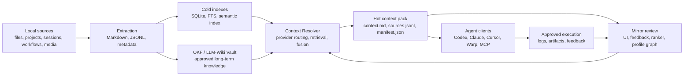

# Architecture

Doctor is a local-first context runtime. Mirror is the personal ranking and review layer above it.

## System View



## Layers

| Layer | Purpose | Main files |
|---|---|---|
| Extraction | Read local files without mutating originals and convert useful content to Markdown/metadata | `ingest.py`, `policies.py`, `douyin.py`, `resume.py` |
| Provider registry | Describe local source families such as projects, sessions, workflows, and documents | `providers.py`, `project_index.py`, `session_index.py`, `file_catalog.py` |
| Cold index | Store searchable local evidence | `cold_index.py`, `semantic_index.py`, `semantic_maintenance.py`, `retrieval_backends.py` |
| Resolver | Decide which sources should be activated for a task | `resolver.py`, `grep_route.py`, `route_selector.py`, `feedback_model.py` |
| Hot pack | Convert retrieved evidence into a bounded agent-readable working set | `pack.py`, `context_review.py`, `answer_review.py` |
| Mirror | Review selected context and learn user-specific ranking signals | `mirror_lab.py`, `mirror_ranker.py`, `profile_graph.py` |
| Runtime | Orchestrate normalize, resolve, answer review, execution review, and feedback | `runtime_vm.py`, `runtime_task.py`, `runtime_review_server.py`, `agent_preflight.py` |
| Interfaces | Expose Doctor through CLI, MCP, local labs, and review clients | `cli.py`, `mcp_server.py`, `lab.py`, `runtime_review_client.py`, `panel.py` |

## Technology Stack

| Area | Current choice |
|---|---|
| Main language | Python |
| Python version | `>=3.11,<3.14` |
| Package manager | `uv` |
| CLI framework | Python `argparse` |
| Document extraction | Microsoft MarkItDown |
| Local formats | JSONL, Markdown, SQLite |
| Keyword search | SQLite FTS / local grep routing |
| Semantic search | Background semantic index, optional `fastembed` dependency |
| MCP | `mcp.server.fastmcp.FastMCP` |
| Local web server | Python stdlib `ThreadingHTTPServer` |
| Frontend | Python-generated HTML/CSS/vanilla JavaScript |
| Tests | `pytest` |

## Frontend Boundary

The repository does not currently contain a standalone frontend application.

There is no React, Vue, Next.js, Tauri, or Electron app in this repo. The current UI surfaces are generated by Python and served through local stdlib HTTP servers:

- Mirror Lab: `src/agent_context/mirror_lab.py`
- Runtime review server: `src/agent_context/runtime_review_server.py`
- Runtime review client export: `src/agent_context/runtime_review_client.py`
- Context panel: `src/agent_context/panel.py`

This is enough for local validation and review gates. It is not yet a finished product client.

## Main Runtime Flow

```text
raw user goal
-> clarify / normalize without reading Doctor indexes
-> resolve approved task through providers and indexes
-> build hot context pack
-> user reviews context and model input
-> client uses context pack
-> user reviews answer
-> approved local execution
-> feedback writes back into routing and ranking signals
```

See [RUNTIME_FLOW.md](RUNTIME_FLOW.md) for phase details.

## Key Invariants

- Source files are read-only inputs.
- Hot context packs are bounded by task and budget.
- `sources.jsonl` is the provenance trail for `context.md`.
- Mirror feedback must not silently rewrite raw evidence.
- Generated local data may contain private paths and snippets.
- Runtime execution must be review-gated.

