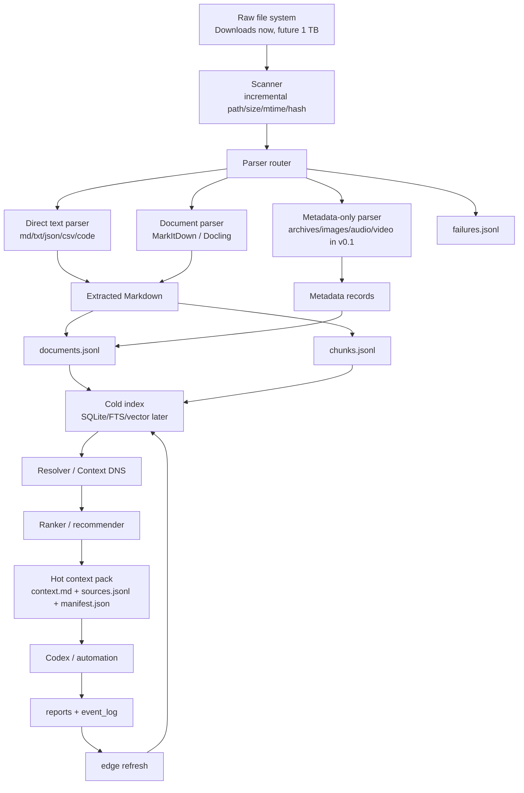

# Agent Context System: Architecture Context

This document summarizes the current design conversation and converts it into a
technical specification for future Codex, cloud, or open-source agents.

It is not a raw transcript. It is a cleaned technical handoff that preserves the
important decisions, local evidence, open questions, and implementation plan.

## 1. Problem Statement

The target is not a normal "chat with documents" RAG app.

The target is a local-first personal agent context layer that lets Codex or
another automation agent answer:

```text
For this task, what part of my local world must the agent know right now?
```

The user framed the system as a combination of:

- Unix-like file and process discipline
- DNS-like name and intent resolution
- search engine retrieval
- recommendation/ranking
- workflow memory
- hot context packaging for agent execution

The system should eventually support a large local file corpus, potentially
around 1 TB, without loading the full corpus into an LLM context window.

## 2. Core Mental Model

The working model is:

```text
raw file system
  -> project discovery / multi-scope registry
  -> document extraction
  -> cold storage index
  -> resolver / context DNS
  -> retrieval
  -> ranking / recommendation
  -> hot context pack
  -> Codex / automation execution
  -> writeback and edge refresh
```

The user compared this to:

```text
inner transformer:
  the LLM reasons over tokens inside the current context window

outer transformer:
  the local context system selects, ranks, and refreshes relationships among
  files, chunks, entities, projects, tasks, tools, workflows, and memories
```

The key correction is that the outer layer is not a neural Transformer
implementation. It is a persistent, inspectable external attention system.

Architecture diagram with the v0.3 position highlighted:

```text
docs/ARCHITECTURE_V0_3_VECTOR.svg
```

## 3. Cold Index vs Hot Context

### Cold Storage Index

Cold storage index is for search, retrieval, RAG, and MCP tools.

It answers:

```text
Where on my computer is relevant information?
```

Expected storage formats:

- SQLite
- JSONL
- Parquet
- extracted Markdown
- full-text index
- optional vector index
- metadata tables
- failure logs

Cold storage is long-lived, incremental, and machine-oriented.

### Hot Context Pack

Hot context pack is for the current Codex session or automation run.

It answers:

```text
What must the agent know immediately for this task?
```

Expected format:

```text
packs/<task-id>/
  context.md
  sources.jsonl
  manifest.json
```

`context.md` should be small, readable, and directly useful:

- task goal
- must-know facts
- relevant paths
- short source quotes/snippets
- limitations
- next actions

Hot context is not a database. It is a task handoff packet.

## 4. Why Not Put the Database Into Context?

The Basic Memory proof of concept produced:

```text
/Users/gengrf/.basic-memory/memory.db
```

The file was about 2.7 MB logical size and about 3.0 MB on disk during the
local check.

Even though this is not huge, it should not be directly placed into the LLM
context because:

- it is a SQLite binary database
- it contains structure and indexes that are not naturally readable by Codex
- it contains more data than a task usually needs
- it is less useful than a small Markdown pack with explicit paths and facts

The correct pattern is:

```text
cold index
  -> query / resolve / rank
  -> selected snippets and metadata
  -> hot context pack
```

## 5. Local Experiment: Basic Memory

Basic Memory was cloned and run locally.

Local repository:

```text
/Users/gengrf/basic-memory
```

Observed version:

```text
Basic Memory version: 0.21.6
```

The local package also reported a development build earlier:

```text
basic-memory==0.21.7.dev28+de53e0ec
```

The Downloads folder was added as a Basic Memory project:

```text
project: downloads
path: /Users/gengrf/Downloads
database: /Users/gengrf/.basic-memory/memory.db
```

Semantic search and automatic frontmatter updates were disabled for the POC:

```text
BASIC_MEMORY_SEMANTIC_SEARCH_ENABLED=false
BASIC_MEMORY_ENSURE_FRONTMATTER_ON_SYNC=false
BASIC_MEMORY_AUTO_UPDATE=false
```

### Initial Downloads Scope

Approximate scan characteristics:

```text
top-level: 224 files, 27 directories
recursive: 1093 files, about 20 GB
```

High-level extension distribution included:

- no extension
- png
- dmg
- js
- pdf
- xlsx
- md
- jpg
- zip
- txt
- json
- docx
- py
- pkg
- pptx
- mp4
- mp3
- csv
- skill

### Sync Result

The foreground sync completed successfully:

```text
Synced 1079 files
new: 1079
modified: 0
deleted: 0
```

Database statistics after sync:

```text
entities: 1079
observations: 14
relations: 0
search_index: 1093
```

Project info:

```text
Entities: 1079
Observations: 14
Relations: 0
Unresolved: 0
Isolated: 1079
Semantic Search: Disabled
Note types:
  file: 1056
  note: 23
```

Later status showed two new image files in Downloads that had not yet been
synced:

```text
Generated image 3.png
Generated image 3 (1).png
```

### Basic Memory Limitation

Basic Memory is useful as a local Markdown memory and MCP-oriented backend, but
it is not a full document extraction system.

It indexed Markdown-like content well, but for PDF, DOCX, XLSX, PPTX, images,
audio, video, archives, DMG, and package files it mostly produced file-level
entities/metadata rather than full extracted text.

Therefore the next system layer must extract documents before feeding text into
search, manifests, or hot context packs.

## 6. Workflow Memory Reference

A strong workflow-memory example was found in another local project:

```text
/Users/gengrf/pet-asset-library/docs/IMAGE_GENERATION_WORKFLOW.md
```

The file had 381 lines and contained:

- core rule
- directory contract
- source preservation rules
- prompt templates
- generation flow
- import scripts
- normalization
- registry rebuild
- QA checklist
- recovery rules

The important design lesson:

```text
Good agent memory is not just chat history in a database.
Good agent memory is a visible Markdown contract plus manifests, scripts,
reports, QA rules, and recovery rules.
```

For this project, the equivalent is:

```text
docs/FILE_INGESTION_WORKFLOW.md
```

It should define:

- what may be scanned
- what must not be modified
- parser routing
- archive policy
- incremental policy
- output schemas
- context pack policy
- QA checklist
- recovery rules
- current limitations

## 7. GitHub / Open-Source Reference Modules

The system should reuse existing projects instead of building every layer from
scratch.

### Document Extraction

Candidate projects:

- `microsoft/markitdown`
  - converts many file types to Markdown
  - supports PDF, PowerPoint, Word, Excel, images metadata/OCR, audio metadata
    or transcription, HTML, CSV, JSON, XML, ZIP, EPUB, and more
  - for v0.1, archives must still not be expanded even if MarkItDown can do it

- `docling-project/docling`
  - document conversion and parsing for gen-AI workflows
  - stronger reference for PDFs, layout, tables, and structured output

- `apache/tika`
  - broad extraction fallback
  - useful as a design or optional fallback, but may be heavier than v0.1 needs

- `PaddlePaddle/PaddleOCR`
  - candidate for future OCR, especially Chinese and complex layout
  - not required for v0.1

- `openai/whisper` or `ggml-org/whisper.cpp`
  - candidate for future audio/video transcription
  - not required for v0.1

### Context Packaging

Candidate projects:

- `yamadashy/repomix`
  - packs repositories into AI-friendly formats
  - supports MCP
  - useful as a context-pack design reference, though focused on code repos

- Aider repo-map
  - useful conceptual reference for ranking code context by relevance and
    importance

### MCP / Agent Memory

Candidate projects:

- `basicmachines-co/basic-memory`
  - local Markdown memory and MCP
  - useful for long-term workflow memory and note-based agent memory

- `OpenDataLab/MinerU-Document-Explorer`
  - close to document indexing, retrieve, deep read, and MCP
  - useful architecture reference for future RAG/MCP layer

- `modelcontextprotocol/servers`
  - reference MCP implementations
  - useful for future v0.2 interface

### Broader AgentOS References

Projects discussed as relevant references:

- OpenClaw
- Hermes Agent
- SapienX AgentOS
- AIOS
- Rivet agentOS
- MemoryOS
- BuilderMethods Agent OS
- Qualixar OS

The conclusion was that these projects help with long-running agents,
automation, skills, runtime isolation, and memory concepts, but none fully
implements this local personal context DNS layer.

## 8. Personal Context DNS

The user described the target as similar to DNS.

DNS maps:

```text
human-readable name -> machine address
```

This system maps:

```text
task / intent / entity / keyword -> file path / chunk / summary / evidence / tool
```

Examples:

```text
"个人记忆系统"
  -> project notes
  -> Basic Memory experiment
  -> Downloads extraction reports
  -> workflow rules
  -> context packs
```

The resolver should eventually support:

- project aliases
- person/entity names
- task goals
- file/folder aliases
- topic names
- reverse lookup from file to tasks/topics
- TTL-like freshness
- edge weights and decay

## 9. Edge Weights and Refresh

The knowledge graph must not be static.

Edges should refresh based on events:

```text
search hit
included in hot context pack
quoted by Codex
accepted by user
rejected by user
file modified
parser failed
task succeeded
task failed
long-term decay
```

Workflow defines the rules, but it does not perform the update itself.

The refresh system needs:

```text
workflow rule
  -> event_log.jsonl
  -> edge_refresh job
  -> graph_edges store
  -> next ranking run
```

An edge should be multidimensional rather than a single score:

```json
{
  "from": "goal:构建个人助手",
  "to": "file:/Users/gengrf/Downloads/basic-memory-notes.md",
  "relation": "useful_for",
  "semantic_score": 0.81,
  "usage_score": 12,
  "recency_score": 0.67,
  "trust_score": 0.9,
  "success_score": 0.75,
  "negative_score": 0,
  "last_used_at": "2026-06-10T00:00:00+08:00",
  "source": "search + context_pack + user_accept"
}
```

## 10. Hardware Architecture Analogy

The user asked whether TPU and NVIDIA GB200 NVL72 architectures offer lessons.

The useful analogy is hierarchy and interconnect:

```text
LLM context window
  -> hot context pack
  -> SQLite / JSONL / vector index
  -> extracted Markdown
  -> raw 1 TB filesystem
```

This mirrors memory hierarchy:

```text
fast small memory
  -> high-bandwidth memory
  -> interconnect fabric
  -> slower large storage
```

NVL72/TPU-like design lessons for this project:

- keep frequently co-used context close together
- use stable interconnect protocols, such as MCP, JSONL, SQLite, manifests
- route work to specialist parsers instead of running every tool on every file
- treat hot context packs as an external KV cache
- optimize for locality and task-specific working sets

## 11. v0.1 Scope

The user decided that extraction-only is not enough for acceptance.

Therefore v0.1 merges the previous v0.1 and v0.2:

```text
Downloads original files
  -> document extraction
  -> JSONL / Markdown / failures
  -> search / filtering
  -> context.md
  -> Codex can continue from the pack
```

### v0.1 Goal

Given a task goal, the system must automatically generate a Codex-readable hot
context pack from `/Users/gengrf/Downloads`.

Minimum acceptance command:

```bash
agent-context build \
  --scope /Users/gengrf/Downloads \
  --goal "分析 Downloads 里哪些文件适合进入个人助手长期记忆"
```

### v0.1 Required Directory

```text
/Users/gengrf/agent-context-system/
  docs/FILE_INGESTION_WORKFLOW.md
  scripts/
  extracted/
  manifests/
  reports/
  packs/
```

### v0.1 Required Outputs

```text
manifests/documents.jsonl
manifests/chunks.jsonl
manifests/failures.jsonl
extracted/<file_hash>.md
reports/downloads_ingestion_report.md
packs/<task-id>/context.md
packs/<task-id>/sources.jsonl
packs/<task-id>/manifest.json
```

### v0.1 Success Criteria

1. Do not modify original source files.
2. Index archives by filename, size, hash, and path only.
3. Attempt Markdown conversion for PDF, DOCX, XLSX, and PPTX.
4. Write failed files to `failures.jsonl`.
5. Support repeat runs with skip-on-unchanged behavior.
6. Generate `context.md` automatically.
7. Include paths, summaries, short quotes, limitations, and next actions.
8. Codex should be able to read `context.md` and continue the work.

## 12. v0.2 Scope

v0.2 is Codex MCP / automation integration.

Expected tools:

```text
search_context(query)
resolve_context(goal)
read_extract(path)
build_context_pack(goal)
list_failures()
```

Acceptance:

```text
Codex CLI or automation can call the context system directly and generate the
current task context pack without manual file selection.
```

## 13. v0.3 Scope

v0.3 is Personal Context DNS plus edge refresh and broader scaling.

Expected components:

```text
event_log.jsonl
graph_edges.sqlite
edge_refresh
ranker
watcher
full-disk incremental strategy
```

Acceptance:

```text
Files that are used, accepted, rejected, modified, or associated with successful
tasks affect the next ranking result.
```

## 14. Cloud Execution Decision

Running v0.1 directly on the local machine was considered too heavy.

The user asked to generate a cloud-executable task instead.

This was written to:

```text
/Users/gengrf/agent-context-system/docs/CLOUD_TASK_DOWNLOADS_CONTEXT_PACK_V0_1.md
```

The cloud task explicitly states:

- cloud cannot access `/Users/gengrf/Downloads` unless mounted or uploaded
- cloud should implement the system and test on fixtures
- the real Downloads run should happen locally later
- GitHub reuse checks are mandatory
- outputs and acceptance criteria are fixed

## 15. Current Repository Intent

This repository exists to hold:

- the architecture context
- workflow memory
- cloud task instructions
- future implementation code
- test fixtures
- reports
- generated context packs

It should not contain:

- raw private Downloads files
- browser profile/account identifiers
- secrets or tokens
- full raw chat transcripts
- generated large binary indexes

## 16. Current State Checklist

Done:

- Basic Memory local POC
- Downloads indexed as a Basic Memory project
- local cold-index POC database created
- context architecture clarified
- workflow-memory reference identified
- cloud task document written
- this architecture context document written

Not done:

- v0.1 implementation
- `FILE_INGESTION_WORKFLOW.md`
- document extraction layer
- `documents.jsonl`
- `chunks.jsonl`
- `failures.jsonl`
- hot context pack generation
- MCP integration
- resolver/context DNS
- edge refresh
- 1 TB full scan

## 17. Architecture Diagram



## 18. Immediate Next Step

Send the cloud task to a GitHub-backed Codex Cloud environment for:

```text
v0.1 Downloads End-to-End Context Pack
```

The target repository should be this repository, not an unrelated repository
such as `jupiternaut/warp`.
