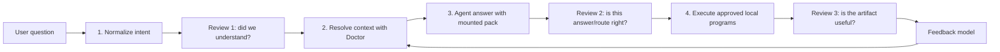

# Doctor Vision Roadmap

## Vision

Doctor is a Docker-like virtual component for a personal macOS context system.
Docker packages files, processes, images, volumes, and execution boundaries.
Doctor packages local knowledge, indexes, working context, permissions,
execution plans, and feedback boundaries for agents.

The product goal is simple:

> A user talks naturally to Codex++, Warp, OpenClaw, or another agent client.
> Doctor figures out what local context should be mounted, what evidence should
> be shown, what execution is safe, and what feedback should change next time.

## Four Review Gates



## Architecture

```text
Client layer
  Codex++ / Warp / OpenClaw / CLI / MCP

Doctor runtime layer
  normalize -> resolve -> answer record -> execute -> feedback

Context virtualization layer
  provider registry
  EvidenceRecord interface
  cold index
  semantic background index
  hot context pack
  source provenance
  access policy

Local operating layer
  macOS files
  Downloads
  Git projects
  Codex/Claude sessions
  workflow docs
  Python/scripts/apps
```

## Product Metaphor

| Docker concept | Doctor equivalent |
| --- | --- |
| image | indexed local context snapshot |
| volume | mounted hot context pack |
| registry | provider registry |
| DNS/network | resolver and source routing |
| container logs | sources, audit, feedback, execution logs |
| docker exec | approved local program execution |

## Roadmap

### V1: Context Runtime Baseline

Status: mostly implemented, final acceptance time-gated.

Scope:

- Downloads ingestion
- provider discovery for projects, sessions, workflows
- SQLite/FTS cold indexes
- semantic background refresh
- hot context packs
- MCP surface
- Codex++ hook/panel smoke
- access policy
- feedback replay
- runtime health and V1 acceptance reports

Exit criteria:

- 10/10 stage-status items pass.
- V1 acceptance is not waiting for semantic multi-day evidence.
- Generated private data remains ignored.

### V2: Doctor Product Contract

Scope:

- `doctor run` as the visible product entrypoint.
- first-class `normalize`, `resolve`, `answer`, `execute`, `feedback` phases.
- `doctor/runs/<run-id>/` artifact contract.
- user review gates between phases.
- execution plan artifacts and approval gates.
- Codex++ integration calls Doctor phases instead of low-level resolver calls.

Exit criteria:

- One realistic task can run through:

```text
normalize -> approve -> resolve -> answer record -> execution plan -> feedback
```

- The run can be stopped and resumed from local artifacts.

### V3: Better Retrieval And Learning

Scope:

- ANN backend as default for semantic retrieval.
- stronger rerank and evaluation cases.
- pairwise feedback learning beyond deterministic priors.
- source diversity and route diversity controls.
- "not right" feedback creates a materially different route.

Exit criteria:

- labeled retrieval eval improves against hash-only baseline.
- feedback changes future source ordering in replay.
- failure cause is separated into intent, context, answer, or execution.

### V4: Product UI And Safety

Scope:

- a simple Doctor dashboard or Codex++ panel with four visible phases.
- permission UI for execution and sensitive source reads.
- audit review.
- per-run artifacts and produced outputs.
- safer defaults for app launches, network calls, and writes.

Exit criteria:

- a non-technical user can see what Doctor knows, what it mounted, what it ran,
  and what changed.
- denied paths and risky execution requests are visible and auditable.

### V5: Broader Local Understanding

Scope:

- OCR
- audio/video transcription
- richer Office parsing
- optional archive expansion under policy
- project importance model
- workflow discovery beyond the current project

Exit criteria:

- Doctor can cover a much larger fraction of the local machine without turning
  the whole disk into a prompt dump.

## Strategic Position

Doctor should not compete directly with ChatGPT Projects or Claude Projects.
Those are project containers where users manually add files. Doctor should be
the missing local context infrastructure beneath agent clients:

```text
ChatGPT / Claude Projects: manual project container
Claude Code: repo-bound coding agent
OpenClaw / Hermes: always-on assistant runtime
DataHub / OpenMetadata: enterprise metadata/context platform
Doctor: personal macOS context virtualization runtime
```
