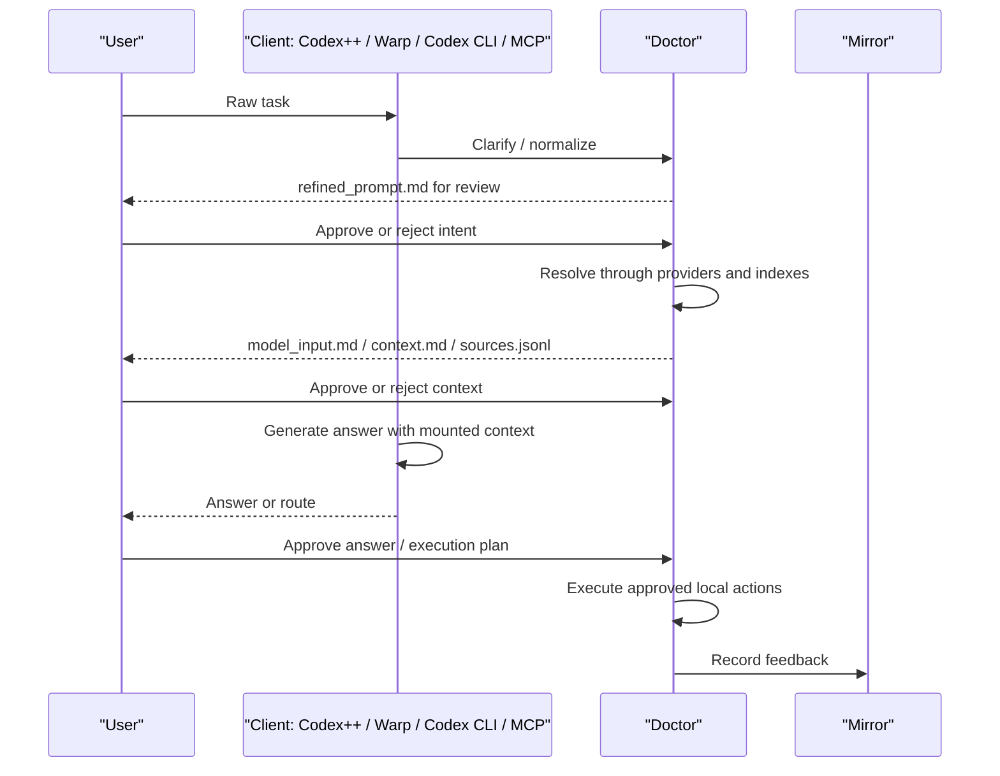

# Runtime Flow

Doctor's product shape is a staged local runtime. Each stage writes files that a user, client, or future agent can inspect.

## Stage Overview



## Phase 1: Normalize

Purpose:

- Convert a raw user request into a clearer task prompt.
- Capture assumptions, constraints, acceptance criteria, and unresolved questions.
- Avoid reading local Doctor indexes during the first intent pass.

Relevant files:

- `src/agent_context/clarify.py`
- `src/agent_context/runtime_task.py`
- `src/agent_context/agent_preflight.py`

Typical artifacts:

```text
runtime/sessions/<session-id>/refined_prompt.md
runtime/sessions/<session-id>/agent_preflight.md
runtime/sessions/<session-id>/agent_preflight.json
```

## Phase 2: Resolve

Purpose:

- Route the approved task to providers.
- Query cold indexes, semantic indexes, provider manifests, or vault pages.
- Build a bounded context pack.

Relevant files:

- `src/agent_context/resolver.py`
- `src/agent_context/pack.py`
- `src/agent_context/providers.py`
- `src/agent_context/vault_index.py`

Typical artifacts:

```text
packs/<pack-id>/context.md
packs/<pack-id>/sources.jsonl
packs/<pack-id>/manifest.json
packs/<pack-id>/resolution_plan.json
```

Cold index lookup answers: "Where is possibly relevant evidence?"

Hot context pack answers: "What should the agent read now for this task?"

## Phase 3: Context And Answer Review

Purpose:

- Let the user inspect what would be sent to a model.
- Separate evidence, inference, and missing context.
- Record whether the selected route was useful.

Relevant files:

- `src/agent_context/context_review.py`
- `src/agent_context/answer_review.py`
- `src/agent_context/runtime_review_server.py`
- `src/agent_context/runtime_review_client.py`
- `src/agent_context/mirror_lab.py`

Typical artifacts:

```text
runtime/sessions/<session-id>/model_input.md
runtime/sessions/<session-id>/context_review.json
runtime/sessions/<session-id>/answer.md
runtime/sessions/<session-id>/answer_review.json
```

Client rule:

- Codex++, Warp, Codex CLI, and MCP clients should consume Doctor artifact paths and metadata.
- They should not embed Doctor resolver internals.

## Phase 4: Execution Review

Purpose:

- Review proposed local commands or actions before running them.
- Execute only approved steps.
- Capture logs and produced artifacts.

Relevant files:

- `src/agent_context/execution_review.py`
- `src/agent_context/runtime_vm.py`
- `src/agent_context/access_policy.py`

Typical artifacts:

```text
runtime/sessions/<session-id>/execution_plan.md
runtime/sessions/<session-id>/execution_review.json
runtime/sessions/<session-id>/execution_log.jsonl
```

Safety rules:

- Writes, app launches, network actions, and shell execution should be review-gated.
- Access policy applies to reads and generated outputs where detectable.

## Phase 5: Feedback

Purpose:

- Record whether failure came from intent, context, answer, or execution.
- Feed future resolver and Mirror ranking behavior.

Relevant files:

- `src/agent_context/feedback_model.py`
- `src/agent_context/mirror_ranker.py`
- `src/agent_context/profile_graph.py`
- `src/agent_context/feedback_replay.py`

Typical artifacts:

```text
feedback/*.jsonl
feedback/model.json
feedback/route_selector_model.json
reports/feedback_replay_*.md
```

## Local Interfaces

| Interface | Command / file |
|---|---|
| CLI | `uv run ./agent-context ...` or `doctor ...` |
| MCP | `uv run ./agent-context mcp --out ...` |
| Doctor Lab | `uv run ./agent-context lab --out ...` |
| Mirror Lab | `uv run ./agent-context mirror-lab-server --out ...` |
| Runtime review UI | `doctor runtime-review-server --out ... --session-id ...` |
| Runtime review client export | `doctor runtime-review-client --out ... --session-id ...` |

## Deeper Docs

- [DOCTOR_RUNTIME_VM.md](DOCTOR_RUNTIME_VM.md)
- [DOCTOR_LAB.md](DOCTOR_LAB.md)
- [MCP_SERVER.md](MCP_SERVER.md)
- [MIRROR_LAB_V0_2.md](MIRROR_LAB_V0_2.md)
- [CONTEXT_ROUTER_FRAMEWORK.md](CONTEXT_ROUTER_FRAMEWORK.md)

